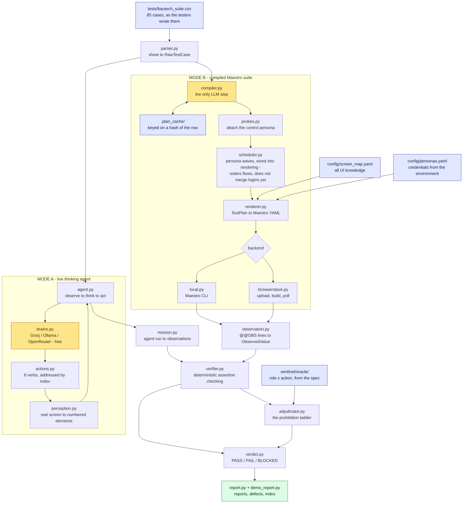

<div align="center">

# Bautech Sentinel

**An autonomous QA agent for the Bautech Android app.**

It reads a regression sheet the way a human tester would, drives the real app on a real device,
observes what actually happened, and returns a verdict — `PASS` / `FAIL` / `BLOCKED` — with the
evidence that earned it.


*Built for Navicon InfraProjects*

**[Full technical assessment (PDF)](docs/Bautech_agent_complete1.pdf)** — this README, formatted for reading and sharing

</div>

---

## Contents

**Part I — Understanding the system**

| | |
|---|---|
| **[1. What This Is](#1-what-this-is)** | The problem, and why an agent rather than a script |
| **[2. The Brief](#2-the-brief)** | What was asked for, and how each requirement is met |
| **[3. Two Execution Modes](#3-two-execution-modes)** | The live agent and the compiled suite |

**Part II — Running it**

| | |
|---|---|
| **[4. Installation](#4-installation)** | Clean machine to ready, step by step |
| **[5. Configuration](#5-configuration)** | Complete environment-variable reference |
| **[6. Using the Live Agent](#6-using-the-live-agent-mode-a)** | **Mode A — the thinking agent** |
| **[7. Using the Compiled Suite](#7-using-the-compiled-suite-mode-b)** | **Mode B — unattended regression** |
| **[8. Reading the Results](#8-reading-the-results)** | Where output lands and how to interpret it |
| **[9. Troubleshooting](#9-troubleshooting)** | Every failure mode seen so far, and its fix |

**Part III — How it works**

| | |
|---|---|
| **[10. Architecture](#10-architecture)** | The full pipeline, stage by stage |
| **[11. The Agent's Mind](#11-the-agents-mind)** | Perception, action vocabulary, the brain, the loop |
| **[12. The Compiler](#12-the-compiler)** | Sheet row to TestPlan |
| **[13. Proving a Negative](#13-proving-a-negative)** | The hardest twenty points in the assessment |
| **[14. Data Contracts](#14-data-contracts)** | Every type the system passes around |
| **[15. Configuration Files](#15-configuration-files)** | screen_map · personas · the permission oracle |
| **[16. The Test Sheet](#16-the-test-sheet)** | Input format, and adding or rewording a case |

**Part IV — Evidence and status**

| | |
|---|---|
| **[17. Verifying the System](#17-verifying-the-system)** | 334 checks, no device required |
| **[18. Results to Date](#18-results-to-date)** | Measured outcomes, not projections |
| **[19. Cost](#19-cost)** | Why a full run is free |
| **[20. Project Structure](#20-project-structure)** | Every file, and what it does |
| **[21. Status and Limitations](#21-status-and-limitations)** | Honest accounting |
| **[22. Defects Found](#22-defects-found)** | What Sentinel found in Bautech |
| **[23. Roadmap](#23-roadmap)** | What comes next, in order |

---
---

# Part I — Understanding the system

## 1. What This Is

Navicon's Bautech regression suite is **85 hand-written cases** across three personas, in the
operations team's own words:

> **TC-009** · *Site Engineer* · `Sites -> look for Add Site.`
> **Expected:** *Blocked — no Add Site option for Site Engineer.*

Sentinel takes that sentence, unmodified, and produces a defensible verdict about the real app.

| Persona | Cases |
|---|---|
| Site Engineer | 34 |
| Admin | 28 |
| Owner | 23 |
| **Total** | **85** |

### Why an agent, not a framework

**This is not a test-automation framework.** A framework needs a human to translate that row into
selectors and assertions. Sentinel does the translation itself, and — in its live mode — decides each
tap while looking at the screen, the way a tester does.

| | Automation script | Sentinel |
|---|---|---|
| **Input** | Code a developer wrote | The tester's sentence, verbatim |
| **Navigation** | A fixed, pre-recorded path | Decided live, from what is on screen now |
| **An unexpected screen** | Fails | Is read, reasoned about, and worked around |
| **Polarity** *(pass-case or block-case)* | Declared by the author | Inferred from the Expected column |
| **A new test case** | New code | A new row in a CSV |
| **When lost** | Fails — or worse, silently passes | Says so, and says why |

That last row is the design's centre of gravity. **A QA system that cannot distinguish *"the app
correctly blocked me"* from *"my automation broke"* will manufacture green results**, and every other
feature it has is worthless. Sentinel refuses to guess — see [Proving a Negative](#13-proving-a-negative).

### What the agent is deliberately never told

Two pieces of information are withheld by construction, not by convention:

- **Which cases are negative.** No flag, no marker, no hint from the permission matrix. The 13 rows
  whose titles carried a `[MUST BE BLOCKED]` editorial tag are **stripped at parse time**, because
  six of the nineteen prohibitions hide theirs in prose instead. Polarity is read from the *Expected*
  text alone, so the result is provably a reading of the requirement rather than an echo of a label.
- **How to do arithmetic.** The agent records `500` and `600`; a deterministic verifier computes the
  delta. **No model anywhere in this system is permitted to decide whether a case passed.**

---

## 2. The Brief

The assessment asked for a system that understands natural-language test cases, navigates, acts,
observes, verifies, judges and reports — catching a seeded regression on Day 13 with no code changes,
running unattended in one command inside two hours. Here is where each requirement lives.

| Requirement | Where it is met | Status |
|---|---|---|
| Understand NL test cases | `parser.py` → `compiler.py`, or the live agent reading the row verbatim | ✅ 85/85 planned |
| Navigate the real app | `perception.py` + `actions.py` (Mode A); `renderer.py` → Maestro (Mode B) | ✅ Proven on hardware |
| Observe what happened | `observation.py` (`@@OBS` protocol); `mission.py` (agent observations) | ✅ |
| Verify and judge | `verifier.py` → `adjudicator.py` → `verdict.py` — all deterministic | ✅ 334 checks |
| Report with evidence | `report.py`, `demo_report.py` | ✅ |
| Prove a negative, not just fail to find | The five-rung ladder + differential probe | ✅ 15/19 + 7 bonus |
| Catch a seeded regression, no code change | Flows and assertions are identical between builds; only the app differs | ✅ Rehearsed in `roundtrip.py` |
| Handle a reworded case live | Cache keyed on a hash of the row — reword is a cache miss | ✅ |
| One command, unattended | `python run.py` | ✅ |
| Under two hours | Persona-wave scheduling | ⚠️ Projected |
| BrowserStack + Maestro | `backends/browserstack.py` | ✅ Proven live |
| Zero recurring cost | Free-tier / local brains | ✅ $0.00 |

---

## 3. Two Execution Modes

Sentinel ships two execution paths over one shared judgment core. This is not redundancy — **each
exists because the other is structurally impossible in its counterpart's environment.**

```
                    ┌──────────────────────────────────────┐
                    │  tests/bautech_suite.csv  (85 rows)  │
                    └──────────────────┬───────────────────┘
                                       │
              ┌────────────────────────┴────────────────────────┐
              ▼                                                 ▼
   ╔═══════════════════════╗                       ╔═══════════════════════╗
   ║   MODE A — LIVE       ║                       ║   MODE B — COMPILED   ║
   ║   thinking agent      ║                       ║   Maestro suite       ║
   ╠═══════════════════════╣                       ╠═══════════════════════╣
   ║ observe → think → act ║                       ║ plan once → render →  ║
   ║ every step, on-device ║                       ║ batch-execute         ║
   ║ driver: adb           ║                       ║ driver: Maestro       ║
   ║ target: local phone   ║                       ║ target: local + cloud ║
   ╚═══════════╤═══════════╝                       ╚═══════════╤═══════════╝
               │                                               │
               └──────────────────┬────────────────────────────┘
                                  ▼
                 ╔══════════════════════════════════════╗
                 ║   SHARED, DETERMINISTIC JUDGMENT     ║
                 ║   verifier · adjudicator · verdict   ║
                 ║   No model. Same code. Same rules.   ║
                 ╚══════════════════════════════════════╝
```

**Mode A — the live thinking agent.** Perceives the real screen over `adb`, chooses one action at a
time against a numbered element list, and re-observes after each. Adaptive, resilient to UI change,
and the only mode that can handle a screen nobody anticipated. Requires a device it can talk to
interactively.

**Mode B — the compiled Maestro suite.** Each row is planned once by an LLM into a structured
`TestPlan`, cached by content hash, then rendered to Maestro YAML and executed as a batch.
Deterministic, parallelisable, and — critically — **the only mode BrowserStack can run at all**,
because its Maestro integration is upload-and-poll:

```
upload the app          -> app_url
upload the zipped flows -> test_suite_url
start a build           -> build_id
poll until it finishes
fetch the logs
```

Nothing can intervene between the second step and the last. That single constraint is the reason this
system plans everything up front and judges everything afterwards.

| | **Mode A · Live Agent** | **Mode B · Compiled Suite** |
|---|---|---|
| Entry point | `tools/live_demo.py` | `run.py` |
| UI driver | `adb` + custom perception | Maestro CLI / BrowserStack |
| Decides taps | Live, per step | Ahead of time, once |
| Needs the screen map | **No** | Yes |
| Handles an unforeseen screen | **Yes** | No |
| Runs on BrowserStack | No *(impossible by design)* | **Yes** |
| Runs 85 cases in parallel | No | **Yes** |
| LLM calls per re-run | One per step | **Zero** (cache hit) |
| Best for | Exploration, adaptation, live walkthrough | Unattended regression, cloud, scale |

> **Recommended:** Mode B for the full unattended regression run; Mode A to demonstrate reasoning, to
> attack a case Mode B declined, or to explore an unmapped screen.

---
---

# Part II — Running it

## 4. Installation

### 4.1 Prerequisites

| Requirement | Needed for | Verify with |
|---|---|---|
| Python 3.10+ *(3.13 verified)* | Everything | `python --version` |
| Android platform-tools (`adb`) | Mode A, local Mode B | `adb version` |
| [Maestro CLI](https://maestro.mobile.dev/) | Mode B | `maestro --version` |
| An Android device or emulator | Any live run | `adb devices` |
| A free [Groq](https://console.groq.com) API key | The agent's brain | — |
| BrowserStack App Automate | Cloud runs only | — |

### 4.2 Install the project

```bash
git clone https://github.com/naveen-astra/Bautech-TestA.git
cd Bautech-TestA
pip install -r requirements.txt
cp .env.example .env          # then fill it in — see section 5
```

`requirements.txt` pins the five libraries this project is verified against. Two of them are
**optional**: `anthropic` only if you choose the paid brain, and `python-docx` only for
`tools/extract_suite.py`.

### 4.3 Install `adb` (Android platform-tools)

Download [platform-tools](https://developer.android.com/tools/releases/platform-tools), unzip it, and
put the folder on `PATH`.

```powershell
# Windows (PowerShell) — adjust the path to where you unzipped it
$env:PATH += ";C:\platform-tools"
adb version
```

Then enable **Developer options → USB debugging** on the phone, connect it, and accept the
authorisation prompt:

```bash
adb devices
# List of devices attached
# R5CT236JF2T     device        <- "device", not "unauthorized"
```

### 4.4 Install Maestro

Maestro ships a POSIX installer. On **macOS / Linux**:

```bash
curl -Ls "https://get.maestro.mobile.dev" | bash
maestro --version
```

On **Windows**, Maestro has no native installer — run the same command inside **WSL2** or **Git Bash**,
and make sure `~/.maestro/bin` is on your `PATH`:

```bash
# Git Bash / WSL2
curl -Ls "https://get.maestro.mobile.dev" | bash
export PATH="$PATH:$HOME/.maestro/bin"
maestro --version
```

> **Mode A does not need Maestro at all.** If you only want to see the thinking agent work, skip this
> step — `adb` is sufficient.

### 4.5 Verify the install — no device needed, 30 seconds

```bash
python tools/selftest.py        # 31 checks — no broken evidence can produce a PASS
python tools/agent_tests.py     # 36 checks — the live agent's loop is sound
python tools/roundtrip.py       # the whole pipeline, three simulated app behaviours
```

All three should end in `All N checks passed.` If they do, the reasoning core is intact and every
remaining problem is environmental.

### 4.6 First real result

```bash
adb devices                     # confirm the phone is attached and authorised
python tools/live_demo.py       # the agent reads the current screen and reasons about it
```

A browser opens on a self-contained report. **You are running.**

---

## 5. Configuration

All configuration is environment variables, resolved at render time and **never written into a flow
file** — flows get zipped and uploaded to a third party, so nothing secret can travel in them.
`run.py` and `tools/live_demo.py` both load `.env` automatically. Anything already exported in your
shell wins over the file, so you can override one variable for one run without editing anything.

### 5.1 The agent's brain

```ini
SENTINEL_BRAIN=groq                       # groq | ollama | openrouter | lmstudio | claude
SENTINEL_BRAIN_MODEL=openai/gpt-oss-120b  # optional — each provider has a sane default
SENTINEL_BRAIN_URL=                       # optional — override the endpoint
GROQ_API_KEY=gsk_...
OPENROUTER_API_KEY=
```

| Provider | Cost | Signup | Notes |
|---|---|---|---|
| `groq` **(default)** | Free tier | Yes | Fastest and strongest free option |
| `ollama` | Free forever | No | Fully offline, no rate limits at all |
| `openrouter` | Free model variants | Yes | Useful spare capacity |
| `lmstudio` | Free | No | Local GUI runner |
| `claude` | **Paid** | Yes | Opt-in only; fails loudly if chosen without a key |

All four free providers speak the **OpenAI chat-completions protocol**, so they are the same code path
with a different base URL. See [section 19](#19-cost).

### 5.2 Persona credentials

```ini
BAUTECH_OWNER_PHONE=          BAUTECH_OWNER_OTP=
BAUTECH_ADMIN_PHONE=          BAUTECH_ADMIN_OTP=
BAUTECH_ENGINEER_PHONE=       BAUTECH_ENGINEER_OTP=
```

Phone numbers **without** the country code — `config/personas.yaml` supplies `+91`.

Bautech has no password login; sign-in is a one-time code. For unattended runs, each number must be
registered in **Firebase Auth as a test number with a fixed verification code**:

> Firebase Console → project **`navicon-erp`** → Authentication → Sign-in method → Phone →
> *Phone numbers for testing*

With that set, **no SMS is sent and no reCAPTCHA appears**, and the code never changes. The Firebase
project id was confirmed from the APK's compiled resources, not guessed — see
`docs/phase1_discovery.md`.

**Fallback if Navicon cannot register test numbers:** set `otp_mode: relay` in `personas.yaml` and
point `SENTINEL_OTP_RELAY_URL` at a small service that polls an IMAP mailbox and serves the newest
code over HTTP. The flow fetches it mid-login using Maestro's own `http` client. Needs nothing from
Navicon, but adds a moving part. Implemented and tested in `sentinel/otp_relay.py` (19 checks); not
yet run against a live mailbox.

```ini
SENTINEL_OTP_RELAY_URL=       # only when otp_mode is `relay`
```

> On BrowserStack the device must be able to *reach* that URL — a public address or a BrowserStack
> Local tunnel, never `localhost`.

### 5.3 Cloud execution

```ini
BROWSERSTACK_USERNAME=
BROWSERSTACK_ACCESS_KEY=
```

### 5.4 Escape hatches

```ini
ANTHROPIC_API_KEY=            # only if SENTINEL_BRAIN=claude
SENTINEL_ALLOW_UNVERIFIED=    # set to 1 to render against unverified screen-map targets
```

> **`SENTINEL_ALLOW_UNVERIFIED` is how a suite starts manufacturing green results.** Leave it empty
> for any run whose verdicts you intend to believe. It exists for exploration, and `tools/live_demo.py`
> sets it for itself because Mode A does not depend on the screen map at all.

---

## 6. Using the Live Agent (Mode A)

> *The agent is handed a case and a real screen, and works out the rest itself.*

### 6.1 Commands

```bash
# Read whatever is on screen right now and identify it   (safest first run)
python tools/live_demo.py

# Run a specific case
python tools/live_demo.py --case TC-006     # Owner views the site list
python tools/live_demo.py --case TC-009     # negative: Engineer must not see "Add Site"
python tools/live_demo.py --case TC-072     # negative: Engineer sees Site A data only

# Log in first, as the case's persona, then run it
python tools/live_demo.py --case TC-009 --login

# Give a harder case more room to think   (default 12)
python tools/live_demo.py --case TC-072 --max-steps 25

# Attach to the session already open on the phone, don't relaunch
python tools/live_demo.py --no-launch
```

| Flag | Effect | Default |
|---|---|---|
| `--case` | `TC-006`, `TC-009`, `TC-072`, or `LOOK` | `LOOK` |
| `--login` | Run the deterministic login as the case's persona first | off |
| `--max-steps` | Step budget; the run stops honestly when exhausted | `12` |
| `--no-launch` | Don't relaunch the app — resume the current session | off |

### 6.2 What you will see

The terminal narrates every decision as it happens:

```
 1. confirm I am on 'Sites List' because: the list shows site entries
    such as 'Aqua Line Mumbai' and a 'New Site' control   -> confirmed
 2. scroll down                                            -> scrolled
 3. note site_count = "2"                                  -> recorded
 4. finish: both sites visible with correct names          -> done
```

Each line is a real decision made against a real screen. **Nothing is replayed.**

### 6.3 Related tools

```bash
# Is the brain reachable? One live call against a fabricated screen.
python tools/brain_check.py

# Watch the real model reason about a real captured screen, with no device
# attached. Proves the reasoning without needing hardware.
python tools/think_offline.py
```

### 6.4 Adding a case to the live agent

`tools/live_demo.py` carries four cases in a `CASES` dict. To run any other row, add it there — the
shape is five fields, exactly as the sheet has them:

```python
"TC-046": Case(
    case_id="TC-046", title="Add cement stock", persona="Site Engineer",
    steps="Material -> Add purchase -> Cement, 50 bags -> Save.",
    expected="Stock increases by 50.",
),
```

No other change. The agent has never seen the case and does not need to have.

---

## 7. Using the Compiled Suite (Mode B)

### 7.1 Commands

```bash
# Plan and render everything against the screen map — executes nothing.
# The fastest way to see what the system intends to do.
python run.py --dry-run

# Full suite on a local device
python run.py

# A subset, while developing
python run.py --only TC-046,TC-009

# Cloud execution on BrowserStack
python run.py --backend browserstack --app app-release_3.apk

# Re-run a flow that CRASHES before reporting  (never a genuine FAIL)
python run.py --max-retries 2
```

| Flag | Purpose | Default |
|---|---|---|
| `--suite` | Path to the CSV | `tests/bautech_suite.csv` |
| `--backend` | `local` or `browserstack` | `local` |
| `--app` | Path to the APK — **required** for BrowserStack | — |
| `--app-id` | Android package id, overrides the screen map | from `screen_map.yaml` |
| `--device` | Device id, or comma-separated cloud devices | auto |
| `--only` | Comma-separated case ids | all 85 |
| `--model` | Compiler model | `claude-sonnet-5` |
| `--dry-run` | Plan and render only — no device required | off |
| `--timeout` | Whole-run budget, seconds | `1800` |
| `--max-retries` | Retries for a **crashed** flow | `1` |

> `--max-retries` never re-runs a flow that finished and reported `FAIL`. That is a real observation,
> not a flake, and retrying it would be how a defect gets masked.

### 7.2 One-click demo

```bash
run_demo.bat                    # Windows — wraps tools/run_demo.py
python tools/run_demo.py        # any platform
python tools/run_demo.py --only TC-001
```

Runs the cases proven end-to-end on real hardware with the local backend, and opens the report the
moment it finishes. **This is not a separate code path** — it is `run.py` with the choices a demo
needs and a human does not want to type. Whatever verdict comes back is real.

### 7.3 Compiling plans

Compilation happens automatically for any case without a cached plan. To do it ahead of time:

```bash
python tools/compile_remaining.py    # compile whatever is not yet cached
python tools/final_tally.py          # the negative-case scorecard across all 85
```

`compile_remaining.py` flushes every line to disk as it goes — a lesson from a real failure where a
background job's buffered output was lost entirely when it had to be killed. Each case's cache write
lands independently of whether the process survives to print a summary.

---

## 8. Reading the Results

### 8.1 Live-agent output (Mode A)

Every run writes **one self-contained folder** — never scattered loose files:

```
results/demos/
  index.html                      ← every run ever, newest first.  START HERE.
  20260911-102921_TC-006/
    report.html                   ← verdict, reasoning trace, screenshots, cost — one page
    screen_start.png              ← what the agent saw first
    screen_final.png              ← where it ended up
    trace.txt                     ← the full step-by-step decision log, plain text
```

`index.html` is **rebuilt from what is actually on disk** on every write, so deleting a run's folder
removes it from the index. The index cannot drift from reality.

The report's verdict badge is one of:

| Badge | Meaning |
|---|---|
| `COMPLETED — screen confirmed` | The agent finished and had cited evidence for where it was |
| `COMPLETED — target screen not confirmed` | It finished, but never proved it reached the right place |
| `GAVE UP (honest)` | It stopped and said why — a real outcome, not a crash |
| `DID NOT FINISH — ran out of steps` | The step budget was exhausted |

### 8.2 Suite output (Mode B)

```
results/<run-id>/
  report.md · report.html         every case, its verdict, and the evidence behind it
  defects.md                      failures only, written up ready to file
  results.json                    machine-readable, one object per case
  console.log                     the raw device log, kept for disputes
  TC-046-0-final.png              screenshots, cited by the verdicts that used them

flows/generated/<run-id>/         the Maestro YAML actually executed
.plan_cache/                      one plan per case, keyed on the row hash
```

Per case, the report shows: **ID · Persona · Expected · Actual · Verdict · Probable cause · Evidence
paths · Duration.** Negative cases additionally show the **adjudication ladder** — which rungs passed,
and the differential-probe result — so a reviewer can audit the reasoning rather than trust it.

All three output directories are gitignored. A run is fully reproducible from the CSV, the screen map
and the plan cache, so none of it needs committing.

### 8.3 How observations get home

A flow prints each observation as one JSON line behind a marker:

```
@@OBS {"key":"stock_before","raw":"500 bags","anchor":true}
```

`observation.py` reads these back out of `maestro.log` locally, or out of BrowserStack device logs in
the cloud. **stdout is the one channel both environments preserve**, so no separate transport is
needed.

Flows are written defensively for a specific reason: **a bare assertion that fails aborts the flow,
and an aborted flow reports nothing.** A test proving a *negative* has to observe the absence, not die
of it — so every check is a conditional that records what it saw and continues, and judgment happens
afterward in Python where it can be reasoned about explicitly.

---

## 9. Troubleshooting

| Symptom | Cause | Fix |
|---|---|---|
| `adb devices` shows `unauthorized` | The phone hasn't trusted this machine | Unlock the phone and accept the USB-debugging prompt |
| `no device found` | Not attached, or `adb` not on `PATH` | `adb version`, then `adb devices` |
| `could not read the screen` | App not in the foreground | Drop `--no-launch`, or open the app by hand |
| Agent gives up on the login screen | **Known Bautech defect** ([BAU-001](#22-defects-found)) — Owner/Admin accounts reset to onboarding after OTP verification | Log in manually once, then run with `--no-launch`; Site Engineer (no company yet) is unaffected |
| `BrainError: ... rate limit` | Groq's per-minute token ceiling | It waits and retries automatically; nothing to do |
| `BrainError: getaddrinfo failed` | Transient DNS, often a VPN resolver (Cloudflare WARP) | Retries up to 8 times on its own; check `nslookup api.groq.com` if it persists |
| `BrainError: ... needs ANTHROPIC_API_KEY` | `SENTINEL_BRAIN=claude` without a key | Switch to `groq` or `ollama` — both free |
| `refuses to render: unverified target` | Screen-map target not confirmed against real hardware | Confirm it from a real hierarchy dump, or set `SENTINEL_ALLOW_UNVERIFIED=1` *(exploration only)* |
| `maestro: command not found` | Maestro not installed, or not on `PATH` | [§4.4](#44-install-maestro); on Windows use WSL2 or Git Bash |
| Screen locks mid-run | A real phone sleeps; an emulator never does | Keep the display awake for the duration of the run |
| Taps land on the keyboard | The on-screen keyboard covers bottom controls | Already handled — the keyboard is dismissed and `mInputShown` read back to confirm |
| BrowserStack upload times out | A 150 MB+ APK on a slow link | Already handled — the upload timeout scales with file size |
| A background compile seems stuck | Two jobs competing for one rate limit | Check for a stray process before starting another run |

### Inspecting a build

```bash
python tools/inspect_apk.py app-release_3.apk
```

Re-derives the package id, version, framework, ABIs, Firebase project, permissions — and, from a
**debug** build, the app's entire English localisation table. Writes `config/apk_report.json` and
`config/app_labels.json`.

---
---

# Part III — How it works

## 10. Architecture



### Stage by stage

| Stage | Module | Decided by | Output |
|---|---|---|---|
| Parse | `parser.py` | Code | `RawTestCase` per row, or a hard error |
| **Perceive** | `perception.py` | Code | One screen as numbered `Element`s, app-only |
| **Think** | `brains.py` + `agent.py` | **LLM** | The next single action |
| **Act** | `actions.py` | Code | A tap, by index, against known bounds |
| Compile | `compiler.py` | **LLM**, cached | `TestPlan` — segments, capabilities, assertions |
| Probe | `probes.py` | Oracle lookup | Control half of each differential probe |
| Schedule | `scheduler.py` | Code | Persona waves, dependency-ordered |
| Render | `renderer.py` | Code | Maestro YAML; credentials passed as parameters |
| Execute | `backends/` | Maestro | `maestro.log`, screenshots, video |
| Observe | `observation.py` · `mission.py` | Code | `ObservedValue` per recorded fact |
| Verify | `verifier.py` | Code | One `AssertionResult` per assertion |
| Adjudicate | `adjudicator.py` | Code + oracle | Prohibition upheld, or automation failure |
| Judge | `verdict.py` | Code | `CaseResult` with evidence and failure class |
| Report | `report.py` · `demo_report.py` | Code | Reports, defect list, run index |

### The trust boundary

> **The model is asked what a case *means*. It is never asked whether a case *passed*.**

That question is settled entirely by comparing recorded observations against declared assertions.
Three consequences follow, and all three are enforced **by the code** rather than by convention:

1. **A plan names intent, never mechanics.** A step says `stock_level`, never a selector — only the
   screen map knows what that resolves to, so the compiler cannot invent UI it has never seen.
2. **An assertion declares the observations it consumes.** A missing observation at verification time
   is an automation failure *by construction*, not because someone remembered to check.
3. **No verdict without evidence.** `CaseResult` refuses to construct without at least one piece of
   evidence, and refuses any non-`PASS` verdict without a failure class separating an app defect from
   the automation's own breakage.

An identical log always yields an identical verdict. A re-run of an unchanged suite makes **zero LLM
calls** in Mode B.

### Persona-wave scheduling

Every login costs a real OTP round-trip. Run 85 cases in sheet order and the three accounts get logged
into dozens of times over, which alone would blow the two-hour budget. `scheduler.py` batches
same-persona work into **waves**, collapsing the login count toward one per persona per run.

The complication is that not every case is single-persona. TC-032 through TC-045 span two — the Site
Engineer submits an eMB, then the Admin approves it, and the approval genuinely depends on state the
Engineer's segment created. So a plan's segments must run **in the order the plan declares them**,
even while different plans interleave freely around each other.

> **Current limit, stated plainly:** the scheduler's ordering is wired into rendering
> (`render_scheduled`, tested with 20 checks) — both backends now execute in wave order, since
> neither takes an explicit run order and both walk the flow directory in sorted-filename order.
> What it does *not* yet do is merge a wave's segments into a single flow behind one shared login —
> that is the change that would actually collapse login count, and it is a real change to the
> renderer's per-flow model, deliberately deferred without device time to confirm it does not
> disturb the anchor-tracking the rest of the renderer depends on.

---

## 11. The Agent's Mind

### 11.1 Perception — what the agent can see

`sentinel/perception.py` runs `uiautomator dump`, then does two things that matter more than anything
else in this module:

**It filters every node to the app under test.** This is not tidiness — it is the fix for a real,
expensive class of bug. A text selector searching the whole device hierarchy matched a Samsung
status-bar notification (*"Galaxy Themes notification: Phone personalization"*) and then, after that
was fixed, the signal-strength icon (*"Phone signal full."*), each time tapping system UI instead of
the app and derailing the run. **An agent that cannot see the status bar cannot tap it.**

**It addresses elements by index, not by text.** The agent says *"tap 14"* — and element 14's exact
bounds are already held. No regex is constructed, so no regex can be ambiguous, over-match or need
anchoring. The entire fuzzy-matching problem — merged Flutter accessibility strings, escaped newlines,
start-anchoring — **simply does not arise at this layer**.

The rendered form is deliberately terse, because it goes into a prompt on every step of every case:

```
Measured on a real Bautech screen:
  raw hierarchy XML   10,412 chars
  rendered listing       909 chars    (18 elements)
  compression              ~11x
  system-UI leakage        zero
```

Each `Element` carries `index · text · role · clickable · focused · scrollable · bounds`.

### 11.2 The action vocabulary — what the agent can do

Eight verbs, plus two terminals. `sentinel/actions.py` validates every call against the dataclass's
own fields, refusing unknown actions and unknown arguments clearly enough that the model can correct
itself.

| Verb | Purpose |
|---|---|
| `tap(index)` | Tap an element by its listed index |
| `type_text(text, index)` | Type into a field |
| `scroll(direction)` | Scroll the screen |
| `back()` | Android back |
| `hide_keyboard()` | Dismiss the IME — **verified**, not assumed |
| `note(key, value)` | Record a value **exactly as displayed**, computing nothing |
| `confirm_screen(screen, evidence)` | State where you are, and what proves it |
| `report_attempt(key, outcome, detail)` | Say what really happened when you tried something |
| `finish(summary, reached_target_screen)` | Terminal — the case is done |
| `give_up(reason)` | Terminal — honestly stuck, and why |

Two of these carry the assessment's hardest requirement:

- **`confirm_screen`** — before drawing any conclusion, the agent must name something only that screen
  shows. *An absence noticed on the wrong screen proves nothing*, and is never allowed to become a pass.
- **`report_attempt`** — when a case says to try something forbidden, the agent *actually tries it* and
  reports what the app really did. The outcome vocabulary is closed:

| Outcome | Meaning |
|---|---|
| `succeeded` | It went through — **for a prohibition, that is a defect** |
| `refused` | The app explicitly said no |
| `no_change` | Accepted in appearance, but nothing moved |
| `error` | The app errored |
| `stalled` | We could not complete the attempt — **our** problem, not the app's |
| `unknown` | Indeterminate |

### 11.3 The brain — where the thinking comes from

`sentinel/brains.py` is one HTTP adapter speaking the OpenAI chat-completions protocol, which is also
spoken by Groq, Ollama, OpenRouter, LM Studio, llama.cpp and vLLM. A free hosted tier and a local
model on your own GPU are the same code path with a different base URL.

It handles two real provider quirks found live:

- **Rate limits are not failures.** A 429 is waited out using the provider's own `retry-after` or
  `x-ratelimit-reset-tokens` header (capped at 65 s per wait) and does **not** count against the retry
  budget. Only genuine connection exceptions do, capped at 8 — raised from 3 after live evidence of
  intermittent VPN DNS flakiness, where one call showed 3 real failures interleaved with 13
  successful-but-rate-limited attempts.
- **Malformed tool calls are recovered, not fatal.** Groq's `gpt-oss-120b` sometimes emits a tool call
  as raw JSON in `content` rather than a proper `tool_calls` entry, producing a 400 that Groq's own
  documentation does not mention. `_recover()` parses the action back out of `error.failed_generation`
  and matches the argument shape to a known verb.

`AnthropicShapedClient` wraps the same adapter to present Anthropic's `client.messages.create(...)`
shape, so the pre-existing `compiler.py` runs on free providers **untouched and still tested**.

### 11.4 The loop

```
observe (perception)  ->  think (brain)  ->  act (actions)  ->  observe  ->  ...
```

Bounded by a step budget. Context is trimmed to the opening brief plus a recent window, so token cost
stays bounded on a long case. A malformed action does not abandon the case — the model is told exactly
what was wrong and gets to correct itself.

What comes out is an `AgentRun`: every step taken, every value noted, every screen confirmation with
its cited evidence, and **the full text inventory of every screen visited.** That last part is what
makes absence provable — *"Site B appeared on none of the six screens I actually reached"* is evidence;
*"my selector found nothing"* is not.

### 11.5 Login is deliberately not an agent problem

`sentinel/login.py` is **plain Python with no LLM call in it at all.** Logging in is a solved problem
that a human tester does not reason about, so spending model calls on it would be waste — and worse,
variance.

It reuses the *same* perception and action layer the agent uses, so it inherits the same immunity to
status-bar mis-taps. It verifies against **real Android state** rather than fixed timing guesses:

```bash
adb shell dumpsys input_method | grep mInputShown    # is the keyboard actually up?
```

Three real bugs were found and fixed here, each by reading an actual failure:

1. A 2.0 s sleep after "Send OTP" was too short — the screen had not transitioned, so the OTP was typed
   into the still-present, max-length-full phone field and **silently dropped with no error.** Replaced
   with a polling loop.
2. With both the phone field and the new OTP field on screen as `role="INPUT"`, a single-match find kept
   returning the phone field. Fixed by finding *any* input whose text is not the phone number.
3. `subprocess.run(..., text=True)` decoded `dumpsys` output as cp1252 on Windows and crashed on a
   non-cp1252 byte **inside subprocess's own reader thread**, leaving `.stdout` as `None`. Fixed by
   capturing raw bytes and decoding UTF-8 with `errors="replace"`.

**`logout()` lives in the same file, structured the same way, but cannot make the same confidence
claim.** It searches for "Logout" or "Sign Out" — both real strings from the build's own localisation
table, not invented — and handles the confirmation dialog those same strings prove exists. What it
does not know is *where* the control lives: no real hierarchy dump has ever shown it, so it only
works from a screen where the control is already visible, and fails with a specific, actionable
reason rather than a guess when it is not. Confirming the real path and adding it to
`screen_map.yaml` is what would let it navigate there itself — see [§21](#21-status-and-limitations).

---

## 12. The Compiler

`sentinel/compiler.py` is the only place an LLM decides anything about *what* a test means. It runs
once per case, offline, before any device is touched, and the result is cached on disk.

```
RawTestCase  ──►  LLM  ──►  TestPlan  ──►  .plan_cache/<id>-<hash>.json
```

**The compiler is deliberately fenced in.** It may only choose capabilities from a closed vocabulary
and targets that already exist in the screen map, so it **cannot invent a selector or a gesture the
renderer would not know how to perform.** A plan naming an unknown target is rejected and repaired,
not executed.

### Caching and rewording

The cache key is a hash of the row text plus a `PROMPT_VERSION` and the screen-map vocabulary hash.
Three consequences:

- **Rewording a case is not a special feature.** Changed wording is simply a cache miss that gets
  re-planned. No code changes, and no list of known phrasings to maintain.
- **A changed prompt or vocabulary invalidates stale plans**, rather than silently reusing plans
  compiled under different rules.
- **A re-run of an unchanged suite costs nothing** — zero LLM calls.

### Capability vocabulary

The closed set the compiler may choose from:

```
login · logout · navigate · open_entity · create_entity · edit_entity · delete_entity
input_value · select_option · search · submit · approve · reject
read_value · capture_screen_text · probe_control · attempt_action · screenshot
```

If a section of the suite needs new Python, **that is a signal the capability layer is too thin** —
the fix is the layer, not a special case.

### Honest infeasibility

A case the compiler cannot reach through interfaces that actually exist is marked
`needs_unavailable_interface` and **names the missing capability**, rather than substituting a weaker
check that would pass for the wrong reason.

---

## 13. Proving a Negative

Nineteen of the 85 cases assert that something must **not** happen. They are worth twenty points, and
they are where the assessment is actually won or lost.

The trap: *"I could not open Site B"* is exactly as consistent with a broken selector as with correct
enforcement. **A system that reads absence as success will cheerfully pass a suite pointed at the wrong
app entirely.**

### The ladder

A prohibition never passes on absence alone. It has to clear five rungs:

| Rung | What it establishes | If it fails |
|---|---|---|
| **a. Reachability** | We proved we were on the right screen | `AUTOMATION_FAILURE` — never `PASS` |
| **b. Affordance** | The control was genuinely not there | falls through to (c) |
| **c. Differential** | The identical probe **does** find it for a permitted persona | `AUTOMATION_FAILURE` — our selector is broken |
| **d. Enforcement** | If the control existed, attempting it was refused | — |
| **e. State** | Nothing actually changed | inconclusive → `BLOCKED` |

**`PASS` on a negative requires (a) AND (b or c) AND (e).**

### The differential probe

This is the rung that makes absence provable. To claim a Site Engineer cannot see *"Add Site"*, the
same probe runs as an Admin in the same session:

| Observation | Conclusion |
|---|---|
| Admin sees it, Engineer does not | The selector works and the app is enforcing → **`PASS` is defensible** |
| **Neither** sees it | Our selector is broken → **`AUTOMATION_FAILURE`**, reported as *our* defect, never as an app pass |

`config/screen_map.yaml` records which spec action each control implements, and `sentinel/oracle/`
knows who the specification permits — so **the control persona is looked up, never hardcoded.**

Where **no** persona is permitted the action at all (TC-080: *"no DMs in V1"*), the differential rung
is structurally unavailable, and the case reports `BLOCKED` with that reason rather than a pass the
evidence cannot support.

### A vacuous truth is not a pass

`personas.yaml` declares that Site B must exist and be visible to Owner/Admin but **not** to the
Engineer. If Site B did not exist at all, *"the Engineer cannot see Site B"* would be vacuously true
and prove nothing. The differential probe is what catches that.

### In the live agent

The same discipline is carried by two actions rather than by the ladder's machinery:

- `confirm_screen` → rung (a). The agent must cite what it can actually see before concluding anything.
- `report_attempt` → rungs (c)–(d). The agent must really attempt the forbidden action rather than
  infer its refusal, and must report `succeeded` plainly if the prohibition turns out **not** to be
  enforced. That is a real finding; hiding it would be worse than useless.

### Refusal markers

14 markers in total, and the file is explicit about which is which — the enforcement rung should not
get credit it hasn't earned. **6 are exact substrings of real, app-authored refusal messages** recovered
from the build's own localisation table — `errAuthNoPermission`, `errDbNoPermissionChange`,
`errorPermission`, `errorUnauthorized`, `machineryVendorsAccessRestricted`,
`reportsMembersNotAllowedAccess`. **The remaining 8 are generic guesses**, kept as a fallback for
refusal text those six don't cover, and labelled as such in `screen_map.yaml` rather than presented as
equally confirmed.

---

## 14. Data Contracts

Everything the system passes around is a pydantic model in `sentinel/schema.py`, with its invariants
enforced at construction.

```
RawTestCase        one row of the sheet, unmodified
    ↓
TestPlan           the compiled intent
  ├─ Segment[]     a run of steps performed by one persona
  │    └─ Step[]   one capability invocation
  └─ Assertion[]   one checkable claim drawn from the Expected column
    ↓
ObservedValue[]    what the device actually reported back
    ↓
AssertionResult[]  one result per assertion
    ↓
CaseResult         verdict + failure class + evidence
```

### Assertion kinds

| Kind | Checked by | Prohibition? |
|---|---|---|
| `numeric_delta` | `after - before == expected_delta` | |
| `numeric_equals` | exact value | |
| `text_contains` | substring presence | |
| `control_present` | the affordance exists | |
| `control_absent` | the affordance does not exist | **yes** |
| `token_absent` | text absent **everywhere in scope** | **yes** |
| `action_rejected` | the attempt was refused | **yes** |
| `semantic` | LLM, over captured evidence only | |

> **Numeric state is always a delta, never an absolute.** `read → act → read`, then assert
> `after − before == qty`. Absolute values break on the second run; deltas do not.

> **A `semantic` assertion receives only captured evidence** — screen-text inventory, observed values,
> screenshot paths — and must cite which piece of evidence drove the call. No citation → the verdict is
> downgraded to `BLOCKED`. The LLM is never the sole source of truth.

### Verdicts and failure classes

Kept deliberately separate, because *what happened* and *whose fault it is* are different questions:

| Verdict | | Failure class | Meaning |
|---|---|---|---|
| `PASS` | | `application_defect` | Bautech is broken |
| `FAIL` | | `automation_failure` | **We** are broken |
| `BLOCKED` | | `environment_block` | The environment prevented the test |
| | | `missing_interface` | No interface exists to test this through |

`CaseResult` **refuses to construct** without at least one piece of evidence, and refuses any
non-`PASS` verdict without a failure class. Every verdict must be defensible: **no evidence, no claim.**

---

## 15. Configuration Files

### 15.1 `config/screen_map.yaml` — the generality lever

**All UI knowledge lives here, as data, not code.** A compiled `TestPlan` names logical targets
(`stock_level`, `add_site_button`); this file turns them into Maestro selectors. That split is what
keeps the system general: **when Bautech moves a button, this file changes and no Python does.**

| Section | Entries | What it holds |
|---|---|---|
| `meta` | 6 | package id, platform, toolkit, build, Firebase project |
| `screens` | 22 | each with an `anchor` — the element that proves arrival |
| `navigation` | 11 routes + 2 drawer entries | how to move between screens |
| `controls` | 10 | buttons and affordances, each tagged with the spec action it implements |
| `values` | 4 | readable state (stock levels, totals) |
| `entities` | 5 | sites, materials, tasks, parties |
| `refusal_markers` | 14 | real app-authored permission-error strings |
| **Targets total** | **41** | **4 verified against real hardware** |

Each entry carries a `source`, which is what keeps the honesty visible:

| Source | Meaning |
|---|---|
| `apk_string` | Exact text pulled from this build's localisation table |
| `screenshot` | Read off a real screen capture |
| `guide` | Named in *"Bautech — The Complete Guide"* |
| `assumed` | A plausible guess, unconfirmed by any of the above |

> **`verified: true` means one thing only:** confirmed against a *running* build via
> `maestro hierarchy`. That a label exists in the APK says nothing about which screen shows it. The
> renderer refuses to emit a flow for an unverified target unless `SENTINEL_ALLOW_UNVERIFIED=1`.

**`anchor` must be something only that screen shows.** The lint exists because screens were originally
anchored on the same text as the nav item that opens them — tap "Material", then check "Material" is
visible, which passes whether or not the screen ever opened. 9 of 11 such anchors were replaced with
real, distinct screen titles recovered from the build; 2 (`reports`, `issues`) remain genuinely
unresolved and are flagged rather than forced.

### 15.2 `config/personas.yaml` — who signs in, and how

**No secret is stored here.** Every credential is an *environment variable name*, resolved at render
time. This file is safe to commit and a leaked repo leaks nothing.

It also declares the **fixtures** the suite assumes exist — Site A, Site B, and which sites the
Engineer is assigned — so a preflight can check and repair them rather than letting eighty cases fail
one by one because a site was renamed.

### 15.3 `sentinel/oracle/permissions.yaml` — the specification oracle

The complete role × action permission matrix from Navicon's own published specification
(*"Bautech — The Complete Guide"*, §4).

**What it is for:** an *independent* expectation, separate from the sheet's Expected column. It
explains and cross-checks verdicts, and picks the control persona for a differential probe.

**What it is not:** it never sets a verdict. A verdict comes from what the device actually did. **If
this file and the observed behaviour disagree, that disagreement *is* the finding** — it is reported,
not resolved by trusting the document.

Grant vocabulary: `full` `yes` `yes_plus` `view` `site` `own` `own_project` `raise` `log` `stock`
`fin` `del` `if_set` `link` `none`. Anything other than `none` means the affordance should exist.

---

## 16. The Test Sheet

`tests/bautech_suite.csv` carries the same five columns the testers already use:

```csv
ID,Test case,Who,Steps to replicate,Expected result
TC-001,Create site,Owner,Sites -> Add Site -> name it Site A -> fill details -> Save.,Site A is created and opens; it appears in the site list.
```

Regenerate it from Navicon's source document with:

```bash
python tools/extract_suite.py "path/to/Testing Day-Wise_word.docx"
```

### Two things are deliberately discarded on the way in

- **The P/F and Remarks columns.** They record a previous manual run, and letting them reach the
  compiler would hand it the answers.
- **The `[MUST BE BLOCKED]` title hints**, present on only 13 of the 19 prohibitions — six hide theirs
  in prose instead (*"Engineer must NOT have this option"*). **Polarity is read from the Expected
  column alone**, so the result is provably a reading of the requirement, not an echo of a label.

The parser reports what it stripped, every run:

```
[parser] stripped editorial hints from 13 title(s); polarity is read from the Expected column
```

### Adding a new case

Open the CSV, add a row, save. **No code changes.**

```csv
TC-086,Add cement stock,Site Engineer,Material -> Add purchase -> Cement 50 bags -> Save,Stock increases by 50
```

```bash
python run.py --only TC-086
```

### Test isolation and repeatability

Two consecutive runs must produce identical verdicts. Achieved by construction, not by hoping:

1. **Run-scoped namespace.** Every entity a test creates is named `SNTL-<TCID>-<runid>`. No two runs
   collide, and no test sees another's data.
2. **Delta assertions.** Absolute state drift becomes irrelevant.
3. **Fixture preflight.** The invariant world is checked and repaired before the suite starts.
4. **Cleanup in `onFlowComplete`**, plus a sweeper for anything matching `SNTL-*` older than the current
   run. Cleanup failure is logged, never silently swallowed.
5. **Numeric identity is read back, not assumed** — after a create, we re-read and confirm.

---
---

# Part IV — Evidence and status

## 17. Verifying the System

**334 checks across eleven suites, plus a full pipeline round trip — none of which need a device.**

```bash
python tools/component_tests.py     # 58 — malformed input is refused
python tools/browserstack_tests.py  # 47 — the cloud batch boundary
python tools/agent_tests.py         # 36 — the live agent's loop
python tools/mission_tests.py       # 33 — the agent decides how, never whether
python tools/brain_tests.py         # 29 — the brain is swappable and never silently paid
python tools/login_tests.py         # 26 — login() and logout(), stubbed device
python tools/report_tests.py        # 26 — one folder, one report, one index
python tools/scheduler_tests.py     # 20 — persona-wave scheduling, wired into rendering
python tools/otp_relay_tests.py     # 19 — the email-OTP fallback
python tools/selftest.py            # 31 — no broken evidence can produce a PASS
python tools/retry_tests.py         #  9 — retries recover crashes, never mask a defect
python tools/roundtrip.py           # the whole pipeline, three app behaviours
```

Four of these carry more weight than the rest:

- **`selftest.py`** covers every way a verdict can go wrong — a broken selector, a screen never
  reached, evidence never captured. **None is allowed to produce a `PASS`.** If that guarantee ever
  breaks, this suite can manufacture green results and nothing else here is worth trusting.
- **`roundtrip.py`** drives real cases against three simulated app behaviours — **healthy**, a **seeded
  regression**, and **broken automation** — and checks each lands on the correct verdict *and* the
  correct failure class. Only the device is faked: the flow is really rendered, the log is really
  parsed by the same code that reads `maestro.log`, and the verdict is really decided by the
  adjudicator. **This is the Day-13 rehearsal.**
- **`mission_tests.py`** proves the boundary holds: numbers settled by subtraction rather than agent
  opinion; absence unproven without a confirmed screen; a forbidden action that *succeeded* reported
  rather than buried; a lost agent producing `BLOCKED` rather than a verdict.
- **`agent_tests.py`** proves the live loop with a scripted brain and a stubbed device: perception
  filtering, vocabulary refusal, honest give-up, step-budget enforcement, and **recovery from a
  malformed action** without abandoning the case.

### The anti-false-positive guarantee

The single most important test in the repository is the **inverted negative**: deliberately break a
selector, and confirm the negative case reports `AUTOMATION_FAILURE` — **not** `PASS`. That inverted
result is the proof the whole design works.

### Additional audits

```bash
# No control flow anywhere in the engine is keyed on a case id — a disqualifier
# if present. Returns nothing.
grep -rn "case_id *==\|== *[\"']TC-" sentinel/ --include=*.py

# Repeatability: two back-to-back runs, verdict sets diffed — must be identical
python run.py && python run.py
```

> A plain `grep -rn "TC-0" sentinel/` returns four hits, all of them prose in module
> docstrings (`browserstack.py`, `parser.py`, `scheduler.py`) that cite specific cases as
> examples. None is executable. The narrower audit above is the one that matters: **no
> branch, lookup or special case anywhere in `sentinel/` depends on which test is running.**

---

## 18. Results to Date

Every figure below is measured, reproducible from this repository, and re-derivable with the command
shown.

### 18.1 Reading polarity from prose — with no hints

```bash
python tools/final_tally.py
```

| Metric | Result |
|---|---|
| Cases in the sheet | **85** |
| Planned and cached | **85 / 85** |
| Official negatives correctly derived as a structural prohibition | **15 / 19** |
| Honestly missed | **1** — TC-068, planned as semantic rather than as a prohibition |
| Honestly declined as not-yet-automatable | **3** — TC-019, TC-044, TC-064, each naming its screen-map gap |
| **Bonus** prohibitions caught *outside* the official 19 | **7** — TC-003, 004, 007, 010, 015, 023, 024 |

Those seven are **compound rows with a negative buried inside them.** Nobody flagged them; the system
found them anyway. The agent was never told which rows were negative — polarity came purely from
sentences like *"Blocked — no Add Site option for Site Engineer."*

Correctly derived, with the assertion kind each produced:

```
TC-009 control_absent     TC-020 action_rejected   TC-021 token_absent
TC-030 control_absent     TC-031 action_rejected   TC-045 token_absent
TC-051 action_rejected    TC-056 control_absent    TC-067 token_absent
TC-072 token_absent       TC-073 token_absent      TC-074 token_absent
TC-077 token_absent       TC-080 control_absent    TC-083 action_rejected
```

### 18.2 On real hardware

| Proven | Evidence |
|---|---|
| Perception reads a real Bautech screen, app-only | 18 elements from 10,412 chars of raw XML → 909 chars rendered; **zero** system-UI leakage |
| The agent reasons about a real screen and cites evidence | *"confirm on 'Sites List' because: the list shows site entries such as 'Aqua Line Mumbai'…"* |
| The agent solves an unforeseen obstacle unprompted | Blocked by the OTP defect, it tried **"Sign in with Google"** on its own and authenticated |
| Deterministic login, repeatably | Verified against real Android state (`dumpsys input_method`), not fixed sleeps |
| Local Maestro backend | **3 consecutive runs, identical verdicts** |
| **BrowserStack, live** | Real build on **Samsung Galaxy S22 · Android 12**; session JSON, device logs, Maestro logs and video all retrieved through the API |

> The BrowserStack run reported `failed` — **because the app failed to log in**, which is precisely the
> defect documented in [§22](#22-defects-found). The backend itself completed its full upload → build →
> poll → retrieve cycle correctly. **Sentinel reported what actually happened rather than what would
> have looked better.**

### 18.3 Findings that became standing rules

Each was found by reading an actual failure — a screenshot or a hierarchy dump off a physical device —
never guessed at. Each is now a rule in the renderer rather than a one-off patch.

- **Flutter merges a whole widget's text into one accessibility node.** A tab's real label was
  `"Phone\nTab 1 of 2"`; a card's was its entire visible content run together. Confirmed independently
  in three widgets → **every emitted text selector is fuzzy-matched by default.** An exact match cannot
  see into a merged string, and a fuzzy match costs nothing on the labels that turn out clean.
  *(Mode A sidesteps this entirely by addressing elements by index.)*
- **The on-screen keyboard covers controls at the bottom of the screen.** A tap resolves through the
  accessibility tree, not pixels, so it **reports success while the physical touch lands on the
  keyboard.** Fixed with a *verified* dismissal — `mInputShown` is read back, never assumed.
- **A reachability check immediately after resuming an app has no patience.** The very first check can
  fire before the screen has redrawn. Every anchor check now waits before it judges.
- **A real phone locks its screen mid-run; an emulator never does.**
- **BrowserStack's upload needs a size-scaled timeout.** A flat 300 s was too short for a 150 MB+ APK —
  the socket's own `send()` timed out. Now scales with file size, up to a one-hour cap.
- **Connection-level failures during upload deserve a retry.** They happen *before* any device work or
  verdict exists, so they can never mask a defect. Bounded at 3, rewinding the file body each time.

### 18.4 What the APK inspection recovered

`tools/inspect_apk.py` on the debug build produced more than metadata. A **debug** Flutter build embeds
the generated localisation source, and gen-l10n writes the English text as a doc comment:

```dart
/// In en, this message translates to:
/// **'Add Site'**
String get homeScreenAddSiteTitle;
```

Parsing `kernel_blob.bin` for that pattern recovered **6,779 distinct English UI strings** into
`config/app_labels.json` — turning most of the screen map from a screenshot guess into a
build-grounded candidate. It also:

- Confirmed the package id `com.naviconinfra.bautech`, version 0.1.2, min/target SDK 24/35
- Confirmed the Firebase project is **`navicon-erp`** — the console to register test numbers in, from
  compiled resources rather than a guess
- Confirmed the login flow strings the renderer already sends: `Phone`, `Email`, `Send OTP`, `Verify`
- Fixed **9 of 11** lint-flagged anchors with real distinct screen titles
- Found **6 real refusal messages** to replace generic guesses
- Found a **genuine ambiguity** and left it flagged rather than silently resolved: *"Add Site"*, *"New
  Site"* and *"Create Site"* are all real strings, likely at different points of the flow

---

## 19. Cost

**A full run costs nothing.** This is a design property, not a coincidence.

| Component | Cost |
|---|---|
| The agent's brain | **$0.00** — Groq free tier, or Ollama locally with no limits at all |
| Plan compilation (85 cases) | **$0.00** — same free provider, then cached, so re-runs are free by construction |
| Maestro | $0.00 — open source |
| BrowserStack | $0.00 — free tier |
| The device | One you already own |

Anthropic's API is supported as an explicit, **opt-in** fallback that **fails loudly, naming the free
alternatives**, rather than silently spending money.

### Why a small free model suffices

Not because small models are secretly as good, but because **this agent's job was deliberately made
narrow.** On each step the model sees roughly 900 characters — a numbered list of one screen — and picks
one of eight verbs against an element index. It never parses XML, never composes a selector, never
chooses from an open-ended action space. That is a job a 7B model does reliably; free-form phone
automation is not, and **this design is the difference.**

Where a weaker model does show through is judgment under ambiguity — reading a genuinely confusing
screen, or deciding a case is unattemptable. Those surface as `give_up`, which is honest and cheap,
**because no model here is ever allowed to decide a verdict.**

### Measured

```
Compiling all 85 cases:
  33 calls · 89,588 tokens in · 28,739 out · 95s of thinking · $0.00
```

---

## 20. Project Structure

```
run.py                      Mode B entry point — the single command
run_demo.bat                one-click demo (Windows)
requirements.txt            pinned dependencies
.env.example                every environment variable, documented

config/
  screen_map.yaml           ALL UI knowledge — 41 targets, 4 verified
  personas.yaml             who signs in, how the OTP is obtained, fixtures
  apk_report.json           output of tools/inspect_apk.py
  app_labels.json           6,779 UI strings recovered from the build

tests/
  bautech_suite.csv         the 85 cases, as the testers wrote them
  fixtures/                 real captured hierarchies, for device-free tests

sentinel/
  ── the live thinking agent (Mode A) ──────────────────────────────
  perception.py             real screen  ->  numbered elements, app-only
  actions.py                the 8 verbs, addressed by index
  agent.py                  observe -> think -> act, with a step budget
  brains.py                 Groq / Ollama / OpenRouter / LM Studio / Claude
  login.py                  deterministic login — no LLM, verified state
  mission.py                agent run  ->  observations  ->  formal verdict
  demo_report.py            one folder, one report, one index

  ── the compiled suite (Mode B) ───────────────────────────────────
  parser.py                 sheet  ->  RawTestCase, hints stripped
  compiler.py               LLM: RawTestCase  ->  TestPlan, cached
  probes.py                 attaches the control half of each differential probe
  screen_map.py             logical target  ->  Maestro selector, with lint
  scheduler.py              persona-wave DAG
  renderer.py               TestPlan  ->  Maestro YAML, and the @@OBS protocol
  backends/
    local.py                Maestro CLI
    browserstack.py         upload, build, poll, retrieve
  junit.py                  reads a JUnit report back for testCaseId -> failed
  otp_relay.py              email-OTP fallback

  ── shared judgment (both modes) ──────────────────────────────────
  schema.py                 the TestPlan contract and its invariants
  observation.py            logs  ->  ObservedValue
  verifier.py               deterministic assertion checking
  adjudicator.py            the prohibition ladder
  verdict.py                assertion results  ->  PASS / FAIL / BLOCKED
  report.py                 report.md, report.html, defects.md, results.json
  oracle/permissions.yaml   role x action matrix, from Navicon's spec

tools/
  ── running ──────────────────────────────────────────────────────
  live_demo.py              ** Mode A on a real phone **
  run_demo.py               ** Mode B, demo-configured, opens the report **
  compile_remaining.py      compile whatever is not yet cached
  ── inspecting ───────────────────────────────────────────────────
  think_offline.py          real model reasoning against a captured screen
  brain_check.py            one live call — is the brain reachable?
  browserstack_check.py     credentials and connectivity
  inspect_apk.py            package info + UI vocabulary from a build
  extract_suite.py          rebuild the CSV from the source .docx
  final_tally.py            negative-case scorecard across all 85 plans
  ── proving ──────────────────────────────────────────────────────
  selftest.py  component_tests.py  roundtrip.py  agent_tests.py
  mission_tests.py  brain_tests.py  report_tests.py  retry_tests.py
  scheduler_tests.py  browserstack_tests.py  otp_relay_tests.py
  login_tests.py

docs/
  Bautech_agent_complete1.pdf    this README, rendered as the technical assessment document
  architecture_note.md           the ≤2-page note: how it works, limits, cost, roadmap
  defects.md                     the standalone defect list — app defects vs automation failures
  phase1_discovery.md            real-device environment findings
  navicon_email_login_reset.md   the login defect, as reported to Navicon

results/
  demos/index.html               ← every live-agent run, newest first
  <run-id>/                      ← per-suite-run reports and evidence
```

---

## 21. Status and Limitations

### Component status

| Component | Status |
|---|---|
| Test-sheet extraction · parser · plan schema | ✅ **Complete** |
| Permission oracle (role × action) | ✅ **Complete** |
| Plan compiler — all 85 cases compiled and cached | ✅ **Complete** |
| Perception · actions · agent loop · brains | ✅ **Complete** — proven on real hardware |
| Deterministic login | ✅ **Complete** — mechanically reliable every run |
| Deterministic logout | ⚠️ **Built and tested against a fixture** — never yet run on real hardware |
| Differential probe generation | ✅ **Complete** |
| Maestro renderer & observation protocol | ✅ **Complete** — hardened by real-device findings |
| Verifier · adjudicator · verdict engine · reporting | ✅ **Complete** |
| Bounded retries | ✅ **Complete** — re-runs a crash, never a real `FAIL` |
| Local backend | ✅ **Proven** — 3 consecutive identical real-device runs |
| BrowserStack backend | ✅ **Proven live** — build executed, artifacts retrieved |
| Demo reporting & index | ✅ **Complete** |
| Persona-wave scheduler | ✅ **Wired into rendering** — both backends now execute in wave order; merging a wave's segments behind one shared login is still deferred, pending device time |
| Live agent's feasibility gate | ✅ **Decoupled from the compiler's screen-map dependency** — `bypass_feasibility_gate` |
| OTP relay (email fallback) | ⚠️ **Built and tested**, not yet run against a live mailbox |
| Screen map — loader, lint, verification gate | ⚠️ **Partial — 4 / 41 targets verified** |

### Known limitations, stated plainly

- **Most of the screen map is unverified.** `4 / 41` targets are confirmed against real hierarchy dumps
  (`site_home`, `material`, `tasks`, `emb`); the rest carry an unconfirmed selector. The renderer
  **refuses** to emit a flow for an unverified target unless `SENTINEL_ALLOW_UNVERIFIED=1`. This is the
  direct cause of the cases the compiler declines — the honest answer is *"I have not seen that screen"*,
  not a weaker check substituted silently. **Mode A has no such dependency**, which is the clearest path
  to closing the gap.
- **The live agent has not yet performed a write action** — create, submit, approve — end to end on a
  real device. Every live run so far has been read-only or exploratory.
- **No live run has yet gone through the full formal verdict bridge.** `mission.py` is complete and
  tested (33 checks), but live demos to date show the reasoning trace rather than a formal `CaseResult`.
- **Persona switching is blocked by the app's own login defect** ([§22](#22-defects-found)).
  `logout()` now exists and is tested against a stubbed screen (26 checks), but it has never run on
  real hardware, and its own docstring is explicit that it cannot yet find its own way to the
  control from an unknown starting screen — no hierarchy dump has ever confirmed where sign-out
  actually lives, so it only works if the control is already visible.
- **A wave's segments still render as separate flows, each with its own login.** The scheduler's
  ordering now reaches both backends (`render_scheduled`, wired into `run.py`), which is a real,
  measured reduction in persona-switching within a run — but the change that would collapse login
  count further, merging a wave behind one shared login, is deliberately deferred: it touches the
  renderer's per-flow anchor-tracking, and that is not something to alter without device time to
  confirm it still holds.
- **The screen-map lint reports 2 unusable anchors**, down from 11. `reports` and `issues` are still
  anchored on the same text as the control that navigates to them, so the check would pass whether or
  not the screen actually opened. `run.py` surfaces these as warnings on every run.
- **A handful of cases are genuinely untestable** through the interfaces available today — billing
  changes that only take effect next cycle (TC-027), pause/unpause billing (TC-028, TC-029), an hours
  threshold that must be crossed (TC-055), quiet hours that must elapse (TC-084). The compiler marks
  these `needs_unavailable_interface` and **names the missing capability** rather than substituting a
  weaker check. These are the legitimate `BLOCKED` candidates.
- **No full-suite wall-clock measurement exists yet.** The two-hour budget remains a **projection**
  until a complete run is timed on real hardware.

---

## 22. Defects Found

Sentinel keeps two lists **structurally separate** in `defects.md`. Conflating *"the app is broken"*
with *"our automation is broken"* is the single failure mode this entire system exists to avoid.

### Bautech defects

#### BAU-001 · OTP verification does not complete for an account with existing company data · *Blocker*

**Symptom.** On a session for an account that already belongs to a company, OTP verification does not
complete and the app returns to onboarding.

**Reproduction.** Across **Owner and Admin**, on **both BrowserStack and physical hardware**, through
**three completely independent automation paths**:

1. Maestro flows driven by the local backend
2. The BrowserStack batch backend, on a Samsung Galaxy S22
3. The live agent's raw `adb` driver with custom perception

Three independent code paths reaching the same wall is strong evidence of a **genuine app defect
rather than a tooling artifact.**

**The Site Engineer account does *not* reproduce this.** It has no company yet, and logs in cleanly
every time onto "Create Company / Join Company" — the asymmetry itself points at post-login data
hydration rather than the login mechanics, and is the basis for the theory in
`docs/navicon_email_login_reset.md`. (Site Engineer has a separate, seemingly unrelated issue: its own
"Create Company" button does not respond to taps at all.)

**Impact.** Blocks unattended multi-persona execution — the single largest remaining obstacle to a
full 85-case run.

**Status.** Reported to Navicon; see `docs/navicon_email_login_reset.md`. **Awaiting response.**

**Corroborating detail.** While stuck on this screen, the agent — unprompted — tried *"Sign in with
Google"* and successfully authenticated via a cached account. The phone path is broken; an alternate
provider works.

### Automation failures

**None outstanding.** Every automation defect found during development is listed in
[§18.3](#183-findings-that-became-standing-rules) alongside the standing rule that now prevents it.

---

## 23. Roadmap

In dependency order — each item unblocks the ones below it.

| # | Task | Status | Blocked by |
|---|---|---|---|
| — | Decouple `mission.execute()`'s feasibility gate from the screen-map-dependent compiler flag | ✅ **Done** — `bypass_feasibility_gate`, 11 new checks in `mission_tests.py` | — |
| — | Wire the scheduler into flow generation | ✅ **Done** — `render_scheduled`, both backends now execute in wave order | — |
| — | Build `logout()` | ✅ **Done** — `sentinel/login.py`, 26 checks against a stubbed device | — |
| 1 | Prove one real **write** action (create / submit / approve) live via the agent | Pending | — *(achievable now)* |
| 2 | Run one case through the full `mission.py` bridge for a formal `CaseResult` | Pending | — *(achievable now)* |
| 3 | Test a genuinely **reworded** case to demonstrate §7.7 with zero code change | Pending | — *(achievable now)* |
| 4 | Build a single-command full-suite runner for the live-agent path | Pending | 1, 2 |
| 5 | Test whether `logout()` survives real hardware and enables persona switching | Pending | BAU-001, a device |
| 6 | Merge a wave's segments into one flow behind one shared login (collapses login count further) | Pending | a device, to confirm the renderer's anchor-tracking survives it |
| 7 | Run the full 85-case live batch; record real pass/fail/BLOCKED counts and wall-clock | Pending | 4, 5 |
| 8 | Verify the screen map's remaining 37 targets against real hierarchy dumps | Pending | a device |
| 9 | Complete BrowserStack 85-case cloud run | Pending | 6, 8 |
| 10 | Produce both run reports (stable build + Day-13 seeded build) | Pending | 7, 9, Navicon's seeded build |
| 11 | Screen recording of a complete unattended run | Pending | 7 |

**External dependencies:** Navicon's response on BAU-001; the Day-13 seeded build; a dedicated test
company with Site A and Site B distinct and working accounts for all three personas; a physical
device or emulator for everything from #5 onward.

---

<div align="center">

**Bautech Sentinel** · Built for Navicon InfraProjects

*The agent decides **how**. It never decides **whether**.*

</div>
