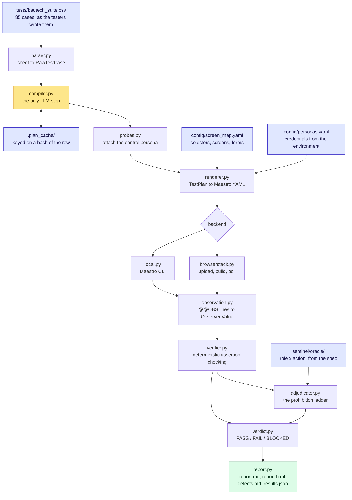

# Bautech Sentinel

**An autonomous QA agent for the Bautech Android app.**
It reads a regression sheet the way a human tester would, plans each case, drives the real app through Maestro, observes what actually happened, and returns a verdict — `PASS` / `FAIL` / `BLOCKED` — backed by the evidence behind it.


---

## Table of Contents

- [Overview](#overview)
- [Key Capabilities](#key-capabilities)
- [Architecture](#architecture)
- [Proving a Negative](#proving-a-negative)
- [Project Status](#project-status)
- [Validated on Real Hardware](#validated-on-real-hardware)
- [Getting Started](#getting-started)
- [Usage](#usage)
- [The Test Sheet Is the Input](#the-test-sheet-is-the-input)
- [Project Structure](#project-structure)
- [Run Artifacts](#run-artifacts)
- [Design Principles](#design-principles)
- [Roadmap](#roadmap)
- [Known Limitations](#known-limitations)

---

## Overview

Bautech Sentinel turns an 85-row manual regression sheet into a suite an unattended agent can run end to end. An LLM plans each case once, from the tester's own words, into a structured, cacheable `TestPlan`. Everything after that — execution, observation, and judgment — is deterministic code. No model is in the loop when a verdict is decided, and a re-run of an unchanged suite makes zero LLM calls.

This split exists because the target environment forces it: BrowserStack runs Maestro as an uploaded batch job — app, flows, and a build request, then poll for a result — so nothing can make a live decision on a cloud device mid-run. Every decision has to be planned up front, which is what makes the plan/execute separation a requirement rather than a preference.

## Key Capabilities

- **Sheet-driven planning.** Reads the testers' own CSV — no rewriting expected results into a DSL by hand.
- **LLM-assisted compilation, cached.** Each row is compiled once into intent-level steps and assertions, keyed by content hash. Reword a row, and only that row gets replanned.
- **Deterministic execution and judgment.** Maestro runs the flow; Python does the arithmetic and string comparison that decides the verdict. No model input at judgment time.
- **Provable negatives.** Prohibition cases (*"the Engineer must not see X"*) are checked against a differential control, not against silence — see [Proving a Negative](#proving-a-negative).
- **Evidence-backed verdicts.** Every `CaseResult` cites the observations behind it. A missing observation is an automation failure, never a pass.
- **Bounded, transparent retries.** A flow that crashes before completing gets one bounded re-run; a flow that completes and reports a genuine `FAIL` is never retried.
- **Dual backends.** A local Maestro CLI backend for a physical device or emulator, and a BrowserStack App Automate backend for cloud execution.
- **Full run reporting.** `report.md`, `report.html`, `defects.md`, and `results.json` per run, with screenshots cited by case.

## Architecture

Nine stages. The model appears in exactly one of them; everything downstream is arithmetic and string comparison.



| Stage | Module | Decided by | Output |
|---|---|---|---|
| Parse | `parser.py` | Code | `RawTestCase` per row, or a hard error |
| Compile | `compiler.py` | **LLM**, cached | `TestPlan` — segments, capability calls, assertions |
| Probe | `probes.py` | Oracle lookup | Control half of each differential probe |
| Render | `renderer.py` | Code | Maestro YAML, credentials passed as parameters |
| Execute | `backends/` | Maestro | `maestro.log`, screenshots |
| Observe | `observation.py` | Code | `ObservedValue` per `@@OBS` line |
| Verify | `verifier.py` | Code | One result per assertion |
| Adjudicate | `adjudicator.py` | Code + oracle | Prohibition upheld, or automation failure |
| Judge | `verdict.py` | Code | `CaseResult` with evidence and failure class |
| Report | `report.py` | Code, LLM for prose | Four artifacts per run |

### The Trust Boundary

The model is asked what a case **means** — which persona, which capabilities, what the *Expected* column is asserting. It is never asked whether a case **passed**. That question is settled entirely by comparing recorded observations against declared assertions, which is why a re-run of an unchanged suite makes zero LLM calls and an identical log always yields an identical verdict.

Two structural rules follow from this:

1. **A plan names intent, never mechanics.** A step says `stock_level`, never a selector — only the screen map knows what that resolves to, so the compiler cannot invent UI it has never seen.
2. **An assertion declares the observations it consumes.** A missing observation at verification time is an automation failure by construction, not by anyone remembering to check for it.

## Proving a Negative

Nineteen of the 85 cases assert that something must **not** happen. The trap: *"I could not open Site B"* is equally consistent with a broken selector as with correct enforcement, and a system that reads absence as success will happily pass a suite pointed at the wrong screen entirely.

A prohibition never passes on absence alone — it has to clear a ladder:

| Rung | What It Establishes |
|---|---|
| Reachability | We proved we were on the right screen |
| Affordance | The control was not there |
| **Differential** | The identical probe *does* find it for a persona who is permitted |
| Enforcement | If the control existed, attempting it was refused |
| State | Nothing actually changed |

The differential rung is what makes absence provable. To claim a Site Engineer cannot see "Add Site," the same probe runs as an Admin in the same session. The Admin sees it and the Engineer does not → the selector works and the app is enforcing correctly. Neither sees it → the selector is broken, and the honest verdict is an automation failure, not a pass. `config/screen_map.yaml` records which spec action each control implements, and `sentinel/oracle/` knows who the specification permits, so the control persona is looked up rather than hardcoded.

Where no persona is permitted the action at all (TC-080: *"no DMs in V1"*), the differential rung is structurally unavailable, and the case is reported `BLOCKED` with that reason rather than a pass the evidence cannot support.

## Project Status

**The pipeline is fully built, fully tested, and has driven a real, logged-in Bautech account on real hardware — repeatedly, with the same correct result every time.** A physical Android device running the unmodified build, real Firebase test credentials, and a real company with real sites and expense data.

| Component | Status |
|---|---|
| Test sheet extraction (85 cases) | Complete |
| Sheet parser | Complete |
| Plan schema & invariants | Complete |
| Permission oracle (role × action) | Complete |
| Screen map — loader, lint, verification gate | Partial — **4 / 41** targets verified against real hardware |
| Plan compiler (LLM, cached) | Complete; not yet run against a live model |
| Differential probe generation | Complete |
| Maestro renderer & observation protocol | Complete — hardened by real-device findings |
| Verifier & negative-case adjudicator | Complete |
| Verdict engine & reporting | Complete |
| Bounded retries (`sentinel/junit.py`) | Complete — re-runs a crash; never touches a real observed `FAIL` |
| Local backend | Proven — 3 consecutive identical real-device runs |
| BrowserStack backend | Partial — implemented against the documented API; not yet exercised live |
| `run.py` — single-command entry point | Complete, with `--max-retries` |
| APK inspection tooling | Complete — run against build v0.1.2 |
| Login flow on real hardware | Complete — logs in and reaches real data, repeatably |
| OTP relay (email fallback) | Partial — built and tested; not yet run against a live mailbox |

## Validated on Real Hardware

Every item below was found by reading an actual failure — a screenshot or a hierarchy dump off a physical device — never guessed at, and each is now a standing rule in the renderer rather than a one-off patch.

- **Flutter merges an entire widget's text into a single accessibility node.** A tab's real label was `"Phone\nTab 1 of 2"`; a card's was its whole visible content run together. Confirmed independently in three different widgets, so every text selector the renderer emits is fuzzy-matched by default — an exact match cannot see into a merged string, and a fuzzy match costs nothing on the labels that turn out clean.
- **The on-screen keyboard covers controls at the bottom of the screen.** Maestro's tap resolves through the accessibility tree, not pixels, so it reports success while the physical touch lands on the keyboard. Fixed with an explicit dismiss before any tap that follows text entry.
- **A reachability check immediately after resuming an app has no patience.** The very first check can fire before the screen has redrawn. Every anchor check now waits before it judges.
- **A real phone locks its screen mid-run; an emulator never does.** Keeping the display awake is now a standing part of the real-device setup checklist.

## Getting Started

### Prerequisites

| Requirement | Needed for |
|---|---|
| Python 3.10+ | Everything |
| [Maestro CLI](https://maestro.mobile.dev/) | Rendering and executing flows |
| `pip install anthropic pyyaml pydantic requests` | LLM compilation, config parsing, schema validation, BrowserStack |
| An Android device or emulator | Local execution |
| `ANTHROPIC_API_KEY` | Compiling any case not already in `.plan_cache/` |
| BrowserStack App Automate account | Cloud execution only (`--backend browserstack`) |

### Installation

```bash
git clone https://github.com/naveen-astra/Bautech-TestA.git
cd Bautech-TestA
pip install anthropic pyyaml pydantic requests
cp .env.example .env   # then fill in credentials — see below
```

### Configuration

All configuration lives in environment variables, resolved at render time and never written into a flow file — flows get zipped and uploaded to a third party, so nothing secret can leak through them. `.env.example` documents every variable in full; the essentials:

| Variable | Purpose |
|---|---|
| `ANTHROPIC_API_KEY` | Plan compilation for any uncached case |
| `BAUTECH_OWNER_PHONE`, `BAUTECH_OWNER_OTP` | Owner persona credentials |
| `BAUTECH_ADMIN_PHONE`, `BAUTECH_ADMIN_OTP` | Admin persona credentials |
| `BAUTECH_ENGINEER_PHONE`, `BAUTECH_ENGINEER_OTP` | Site Engineer persona credentials |
| `SENTINEL_OTP_RELAY_URL` | Only if a persona uses relay-mode OTP |
| `BROWSERSTACK_USERNAME`, `BROWSERSTACK_ACCESS_KEY` | Only for `--backend browserstack` |
| `SENTINEL_ALLOW_UNVERIFIED` | Escape hatch to run against an unverified screen map — leave unset for any run whose verdicts matter |

## Usage

```bash
# Plan and render the full suite against the screen map — executes nothing
python run.py --dry-run

# Run the full suite on a local device
python run.py

# Run a specific subset while developing
python run.py --only TC-046,TC-009

# Run against BrowserStack App Automate
python run.py --backend browserstack --app path/to/bautech.apk

# Retry a flow that crashes before completing, up to N times (default: 1)
python run.py --max-retries 2
```

### Verify the Reasoning Core Without a Device

```bash
python tools/selftest.py         # 31 checks — the judging logic is sound
python tools/component_tests.py  # 58 checks — malformed input is refused
python tools/roundtrip.py        # full pipeline, three simulated app behaviours
python tools/otp_relay_tests.py  # 19 checks — the email-OTP fallback
python tools/retry_tests.py      # 9 checks — retries recover crashes, never mask a defect
```

`selftest.py` covers every way a verdict can go wrong — a broken selector, a screen never reached, evidence never captured. **None of these is allowed to produce a `PASS`.** If that guarantee ever breaks, the suite can manufacture green results, and nothing else here is worth trusting.

`roundtrip.py` drives two real cases against three simulated app behaviours — healthy, a seeded regression, and broken automation — and checks each lands on the correct verdict *and* the correct failure class. Only the device is faked: the flow is really rendered, the log is really parsed by the same code that reads `maestro.log`, and the verdict is really decided by the adjudicator.

## The Test Sheet Is the Input

`tests/bautech_suite.csv` carries the same five columns the testers already use:

```
ID, Test case, Who, Steps to replicate, Expected result
```

Regenerate it from the source document with:

```bash
python tools/extract_suite.py "path/to/Testing Day-Wise_word.docx"
```

Two things are deliberately discarded on the way in:

- **The P/F and Remarks columns** — they record a previous manual run, and letting them reach the compiler would hand it the answers.
- **The `[MUST BE BLOCKED]` title hints**, present on only 13 of the 19 prohibitions — six hide theirs in prose instead (*"Engineer must NOT have this option"*). Polarity is read from the *Expected* column alone, so the result is provably a reading of the requirement, not an echo of a label.

### Adding a New Case

Open the CSV, add a row, save — no code changes:

```
TC-086, Add cement stock, Site Engineer, Material -> Add purchase -> Cement 50 bags -> Save, Stock increases by 50
```

The compiler plans the new row against the same capabilities as everything else. The plan cache is keyed on a hash of the row, so rewording an existing case is a cache miss that gets replanned automatically.

## Project Structure

```
run.py                    single-command entry point
config/
  screen_map.yaml         all UI knowledge — selectors, screens, forms
  personas.yaml           who signs in, and how the OTP is obtained
tests/bautech_suite.csv   the 85 cases, as the testers wrote them
sentinel/
  schema.py               the TestPlan contract and its invariants
  parser.py               sheet -> RawTestCase
  compiler.py             LLM: RawTestCase -> TestPlan, cached
  probes.py               attaches the control half of each differential probe
  screen_map.py           logical target -> Maestro selector
  renderer.py             TestPlan -> Maestro YAML, and the @@OBS protocol
  observation.py          logs -> ObservedValue
  verifier.py             deterministic assertion checking
  adjudicator.py          the prohibition ladder
  verdict.py              assertion results -> PASS / FAIL / BLOCKED
  report.py               report.md, report.html, defects.md, results.json
  junit.py                reads a JUnit report back for testCaseId -> failed
  backends/               local (Maestro CLI) and browserstack (batch API)
  oracle/                 role x action permission matrix from the spec
tools/
  extract_suite.py        rebuild the CSV from the source document
  inspect_apk.py          extract package info + UI vocabulary from a build
  selftest.py             prove the judging is sound
  component_tests.py      prove bad input is refused (58 checks)
  roundtrip.py            drive the whole pipeline without a device
  otp_relay_tests.py      prove the OTP relay works without a real mailbox
  retry_tests.py          prove retries recover crashes, never mask a defect
  demo.py                 narrated walkthrough, simulated device
  demo_login.py           the real login flow against a real device
  demo_live.py            the full pipeline against a real logged-in account
```

## Run Artifacts

```
.plan_cache/                    one plan per case, keyed on the row hash
flows/generated/<run-id>/       the Maestro YAML actually executed
results/<run-id>/
  report.md                     every case, its verdict, and the evidence
  report.html                   the same, formatted for sharing
  defects.md                    only the failures, written up for filing
  results.json                  machine-readable, one object per case
  console.log                   the raw device log, kept for disputes
  TC-046-0-final.png            screenshots cited by the verdicts
```

All three directories are gitignored. A run is fully reproducible from the CSV, the screen map, and the plan cache, so none of it needs to be committed.

### How Observations Get Home

A flow prints each observation as one JSON line behind a marker:

```
@@OBS {"key":"stock_before","raw":"500 bags","anchor":true}
```

`observation.py` reads these back out of `maestro.log` locally, or out of BrowserStack device logs in the cloud — stdout is the one channel both environments preserve, so no separate transport is needed.

Flows are written defensively for a specific reason: a bare assertion that fails aborts the flow, and an aborted flow reports nothing. A test proving a *negative* has to observe the absence, not die of it — so every check is a conditional that records what it saw and continues, and judgment happens afterward in Python where it can be reasoned about explicitly.

## Design Principles

Three rules are enforced by the code itself, not by convention:

1. **A plan names intent, never mechanics.** Steps reference logical targets like `stock_level`, never a raw selector — a UI change becomes a data edit, not a code change.
2. **An assertion declares the observations it consumes.** A missing observation at verification time is structurally an automation failure — the system cannot pass a test it never actually looked at.
3. **No verdict without evidence.** `CaseResult` refuses to construct without at least one piece of evidence, and refuses any non-`PASS` verdict without a failure classification separating an app defect from the automation's own breakage.

## Roadmap

- [x] **Bautech APK** — arrived and inspected (`com.naviconinfra.bautech` v0.1.2, Flutter debug build). See `docs/phase1_discovery.md`.
- [x] **An unattended-capable login route** — solved via Firebase test phone numbers bound to real Bautech accounts. The login flow has completed end to end three times in a row with identical results.
- [ ] **A dedicated test company** with Site A and Site B distinct, and working accounts for all three personas — Owner is confirmed; Admin and Site Engineer are not yet exercised end to end.
- [ ] **Broader screen coverage** — 4 of ~41 screens are verified against real hardware; the remainder of the 85-case suite touches roughly three dozen more.
- [ ] **A BrowserStack App Automate account** for cloud execution — required starting at Phase 7, not before.

## Known Limitations

- **Most of the screen map is still unverified.** `4 / 41` targets are confirmed against real hierarchy dumps (`site_home`, `material`, `tasks`, `emb`); the remaining ~37 carry an unconfirmed selector. The renderer refuses to emit a flow for an unverified target unless `SENTINEL_ALLOW_UNVERIFIED=1` is explicitly set.
- **The compiler has not been run against a live model.** It is validated against a stubbed client — schema flattening, caching, cache invalidation on reword, rejection of unknown targets, and the repair round-trip all pass — but plan quality against the real 85-case suite is unmeasured without `ANTHROPIC_API_KEY` set.
- **The BrowserStack backend has not run against a live account.** It is implemented against BrowserStack's documented Maestro API with no account yet available to exercise it; the log-retrieval path in particular should be expected to need adjustment on first real contact, since it is what all cloud-run evidence depends on.
- **The screen map lint reports 2 unusable anchors**, down from 11. `reports` and `issues` are still anchored on the same text as the control that navigates to them, so the check would pass regardless of whether the screen actually opened. `run.py` surfaces these as warnings on every run until they are replaced from a real hierarchy dump.
- **A handful of cases may be genuinely untestable** through the interfaces available today — billing changes that only take effect next cycle (TC-027), pause/unpause billing (TC-028, TC-029), an hours threshold that must be crossed (TC-055), and quiet hours that must elapse (TC-084) all require real payment, time travel, or a long wait. The compiler marks these `needs_unavailable_interface` and names the missing capability rather than substituting a weaker check.
- **No runtime measurement exists yet.** The projected two-hour budget for a full run is based on assumed per-case timings and will not be reliable until a real case is timed end to end on real hardware.
