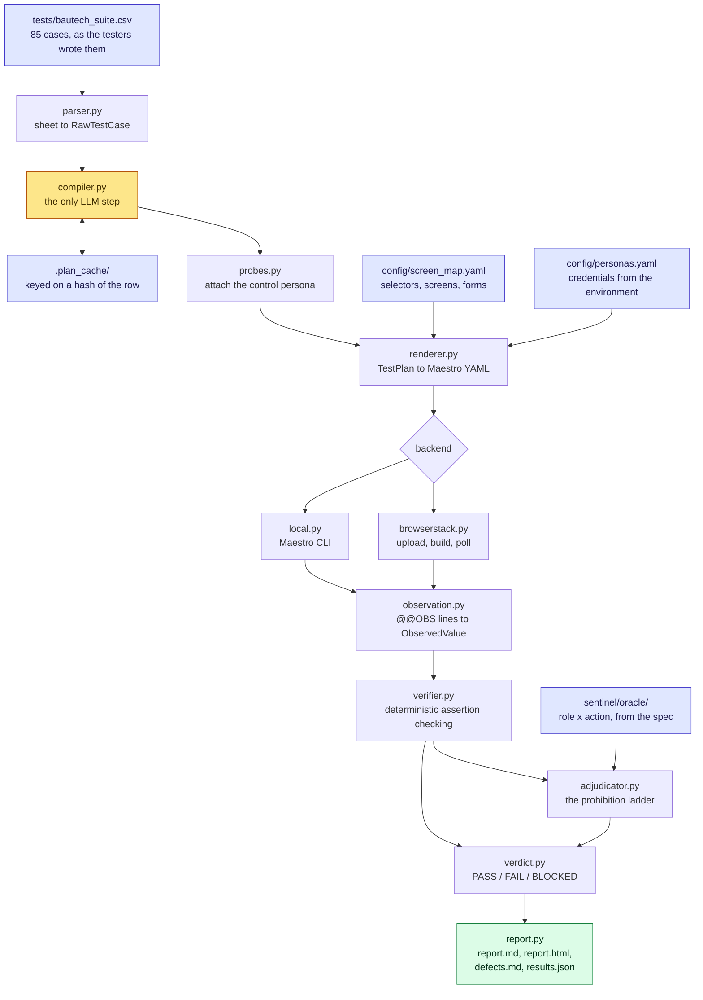

# Bautech Sentinel

An autonomous QA agent for the Bautech Android app. It reads the 85-case
regression sheet as the testers wrote it, plans each case, drives the app
through Maestro, observes what actually happened, and returns PASS / FAIL /
BLOCKED with the evidence behind the call.

## Status

**The whole pipeline is built, tested, and has driven a real logged-in
account on real hardware — repeatedly, with the same correct result every
time.** A Samsung Galaxy A22 running the unmodified build, real Firebase test
credentials, a real Bautech company with real sites and real expense
figures. See [What is still needed](#what-is-still-needed) for what's left.

| Component | State |
|---|---|
| Test sheet extraction (85 cases) | done |
| Sheet parser | done |
| Plan schema and invariants | done |
| Permission oracle (role x action) | done |
| Screen map loader, lint, verification gate | done, **4/41 targets verified against real hardware** |
| Plan compiler (LLM, cached) | done, not yet run against a live model |
| Differential probe generation | done |
| Maestro renderer + observation protocol | done, hardened by real-device failures (see below) |
| Verifier and negative-case adjudicator | done |
| Verdict engine and reporting | done |
| Bounded retries (`sentinel/junit.py`) | done - re-runs a crashed flow, never a real observed FAIL |
| Local backend | done, proven against a physical phone, 3 consecutive identical runs |
| BrowserStack backend | written against the docs, **never exercised** |
| `run.py` single command | done, now with `--max-retries` |
| APK inspection (`tools/inspect_apk.py`) | done, run against v0.1.2 |
| Login flow on real hardware | **done** - logs in, lands on real data, repeatably |
| OTP relay (email fallback) | built and tested, never against a real mailbox |

### What real hardware taught the renderer

Every one of these was found by reading an actual failure - a screenshot or a
hierarchy dump off the phone - never guessed at, and each is now a standing
rule in `sentinel/renderer.py`, not a one-off patch:

- **Flutter merges a whole widget's text into one accessibility node** on
  custom components - a tab's real label was `"Phone\nTab 1 of 2"`, a site
  card's was its entire visible content run together. Confirmed three
  separate times, in three different widgets. Every text selector the
  renderer emits is now fuzzy-matched by default (`_selector`, `_fuzzy_text`)
  because of this - an exact match cannot see into a merged string, and a
  fuzzy match costs nothing on the labels that turn out to be clean.
- **The on-screen keyboard covers buttons at the bottom of the screen.**
  Maestro's tap resolves through the accessibility tree, not pixels, so it
  reports success while the real touch lands on the keyboard. Fixed with an
  explicit `hideKeyboard` before every button tap that follows text entry.
- **A reachability check right after resuming an app has no patience.** The
  very first anchor check can fire before the screen has redrawn, reporting
  false for text that is genuinely there moments later - proven directly,
  since a later step found the identical text. Every anchor check now waits
  before it judges (`extendedWaitUntil`, then the capture).
- **A real phone locks its screen mid-run; an emulator never does.**
  `adb shell svc power stayon` is now a standing part of the real-device
  setup checklist, not a one-off fix.

### Prove it without a device

```bash
python tools/selftest.py         # 31 checks: the judging is sound
python tools/component_tests.py  # 58 checks: bad input is refused
python tools/roundtrip.py        # the full pipeline, three app behaviours
python tools/otp_relay_tests.py  # 19 checks: the email-OTP fallback works
python tools/retry_tests.py      # 9 checks: retries recover crashes, never mask a defect
python run.py --dry-run          # plan and render the real suite, run nothing
```

`selftest.py` covers every way a verdict can go wrong. The ones that matter are
the inverted cases: a broken selector, a screen we never reached, evidence we
failed to capture. **None of them is allowed to produce a PASS.** If that ever
changes, the suite can manufacture green results and nothing else here is worth
anything.

`roundtrip.py` runs two real cases against three simulated app behaviours —
healthy, seeded regression, and broken automation — and checks each lands on the
right verdict *and* the right failure class. Only the device is faked: the flow
is really rendered, the log is really parsed by the code that will read
`maestro.log`, and the verdict is really decided by the adjudicator.

## The idea in one paragraph

An LLM plans; deterministic code executes and judges. Each sheet row is compiled
once into a `TestPlan` — persona segments, capability calls, and the assertions
its Expected column implies — and cached on disk. Execution is plain Maestro
with no model in the loop. Judging is arithmetic and string work. The model is
consulted again only for genuinely semantic expectations and for writing up a
diagnosis. A re-run of an unchanged suite makes zero LLM calls.

This split is not a preference. BrowserStack runs Maestro as an uploaded batch —
you upload the app, upload zipped flows, start a build, and poll — so nothing can
decide taps live on a cloud device. Everything has to be planned up front.

## Architecture

Nine stages. The model appears in exactly one of them, and everything
downstream of it is arithmetic and string work.



| Stage | Module | Decided by | Output |
|---|---|---|---|
| parse | `parser.py` | code | `RawTestCase` per row, or a hard error |
| compile | `compiler.py` | **LLM**, cached | `TestPlan`: segments, capability calls, assertions |
| probe | `probes.py` | oracle lookup | the control half of each differential |
| render | `renderer.py` | code | Maestro YAML, credentials passed as parameters |
| execute | `backends/` | Maestro | `maestro.log`, screenshots |
| observe | `observation.py` | code | `ObservedValue` per `@@OBS` line |
| verify | `verifier.py` | code | one result per assertion |
| adjudicate | `adjudicator.py` | code + oracle | prohibition upheld, or automation failure |
| judge | `verdict.py` | code | `CaseResult` with evidence and failure class |
| report | `report.py` | code, LLM for prose | four artifacts per run |

### The trust boundary

The model is asked what a case *means* — which persona, which capabilities, what
the Expected column is asserting. It is never asked whether a case passed. That
question is settled by comparing recorded observations against declared
assertions, which is why a re-run of an unchanged suite makes zero LLM calls and
why an identical log always yields an identical verdict.

Two structural consequences follow. A plan names intent and never a selector, so
the compiler cannot invent UI it has never seen. And an assertion declares the
observations it consumes, so a missing observation is an automation failure by
construction rather than by anyone remembering to check.

### What a run leaves behind

```
.plan_cache/                    one plan per case, keyed on the row hash
flows/generated/<run-id>/       the Maestro YAML actually executed
results/<run-id>/
  report.md                     every case, its verdict, and the evidence
  report.html                   the same, for sending on
  defects.md                    only the failures, written up for filing
  results.json                  machine-readable, one object per case
  console.log                   the raw device log, kept for disputes
  TC-046-0-final.png            the screenshots the verdicts cite
```

All three are gitignored. A run is reproducible from the CSV, the screen map and
the plan cache, so none of it is worth committing.

## Proving a negative

Nineteen of the 85 cases assert that something must *not* happen. The trap is
that "I could not open Site B" is equally consistent with a mistyped selector,
and a system that reads absence as success will award a PASS to a suite pointed
at the wrong app.

So a prohibition never passes on absence alone. It has to clear a ladder:

| Rung | What it establishes |
|---|---|
| reachability | we proved we were on the right screen |
| affordance | the control was not there |
| **differential** | the same probe *does* find it for a persona who is permitted |
| enforcement | if the control existed, attempting it was refused |
| state | nothing actually changed |

The differential rung is the one that makes absence provable. To claim a Site
Engineer cannot see "Add Site", we run the identical probe as an Admin. Admin
sees it and the Engineer does not — the selector works and the app is enforcing.
Neither sees it — our selector is broken, and the honest answer is an automation
failure, not a pass. `config/screen_map.yaml` records which spec action each
control implements, and `sentinel/oracle/` knows who the spec permits, so the
control persona is looked up rather than hardcoded.

Where no persona is permitted the action at all — TC-080, "no DMs in V1" — the
differential rung is unavailable, and the case comes back BLOCKED with that
reason rather than a PASS we cannot defend.

## The sheet is the input

`tests/bautech_suite.csv` carries the same five columns the testers already use:

```
ID, Test case, Who, Steps to replicate, Expected result
```

Regenerate it from the source Word document with:

```bash
python tools/extract_suite.py "path/to/Testing Day-Wise_word.docx"
```

Two things are deliberately discarded on the way in:

- **The P/F and Remarks columns.** They record a previous manual run. Letting
  them reach the compiler would hand it the answers.
- **The `[MUST BE BLOCKED]` hints in 13 of the titles.** Whether a case is a
  prohibition is read from the Expected column instead. Only 13 of the 19
  prohibitions are tagged — TC-019, TC-056, TC-064, TC-068, TC-072 and TC-077
  hide theirs in prose like "Engineer must NOT have this option" — so a
  tag-reading agent silently misses six of them. Stripping the hint also makes
  the claim testable: the polarity we produce is provably a reading of the
  expectation rather than an echo of a label.

### Adding TC-086

Open `tests/bautech_suite.csv` in Excel, add a row, save:

```
TC-086, Add cement stock, Site Engineer, Material -> Add purchase -> Cement 50 bags -> Save, Stock increases by 50
```

Then re-run. No code changes. The compiler plans the new row against the same
capabilities as everything else. Rewording an existing row works the same way —
the plan cache is keyed on a hash of the row, so changed wording is a cache miss
that gets re-planned.

## Layout

```
run.py                    the single command
config/
  screen_map.yaml         all UI knowledge - selectors, screens, forms
  personas.yaml           who signs in, and how the OTP is obtained
tests/bautech_suite.csv   the 85 cases, as the testers wrote them
sentinel/
  schema.py               the TestPlan contract and its invariants
  parser.py               sheet -> RawTestCase
  compiler.py             LLM: RawTestCase -> TestPlan, cached
  probes.py               attaches the control half of each differential probe
  screen_map.py           logical target -> Maestro selector
  renderer.py             TestPlan -> Maestro YAML, and the @@OBS protocol
  observation.py          logs -> ObservedValue
  verifier.py             deterministic assertion checking
  adjudicator.py          the prohibition ladder
  verdict.py              assertion results -> PASS / FAIL / BLOCKED
  report.py               report.md, report.html, defects.md, results.json
  junit.py                reads a JUnit report back for testCaseId -> failed
  backends/               local (Maestro CLI) and browserstack (batch API)
  oracle/                 role x action permission matrix from the spec
tools/
  extract_suite.py        rebuild the CSV from the Word sheet
  inspect_apk.py           extract package info + UI vocabulary from a build
  selftest.py             prove the judging is sound
  component_tests.py      prove bad input is refused (58 checks)
  roundtrip.py            drive the whole pipeline without a device
  otp_relay_tests.py      prove the OTP relay works without a real mailbox
  retry_tests.py          prove retries recover crashes, never mask a defect
  demo.py                 narrated walkthrough, simulated device
  demo_login.py           the real login flow against a real device
  demo_live.py            the full pipeline against a real logged-in account
```

### How observations get home

A flow prints each observation as one JSON line behind a marker:

```
@@OBS {"key":"stock_before","raw":"500 bags","anchor":true}
```

`observation.py` reads those back out of `maestro.log` locally, or out of
BrowserStack device logs in the cloud. Stdout is the one channel both
environments preserve, so there is no separate transport to arrange.

The flows are written defensively for a specific reason: a bare `assertVisible`
that fails aborts the flow, and an aborted flow reports nothing. A test proving
a *negative* has to observe the absence, not die of it. So every check is a
conditional that records what it saw and continues, and judging happens
afterwards in Python where it can be reasoned about. `anchor` is recorded rather
than asserted for the same reason: a screen we never reached must arrive at the
adjudicator as a fact, so it can be called an automation failure instead of
being scored as a pass.

Three design rules are enforced by the code rather than by convention:

1. **A plan names intent, never mechanics.** Steps say `stock_level`, not a
   selector. Only the screen map knows what that looks like, so the compiler
   cannot invent UI it has never seen, and a UI change is a data edit.
2. **An assertion declares the observations it consumes.** If one is missing at
   verification time, the result is an automation failure. Structurally, we
   cannot pass a test we did not actually look at.
3. **No verdict without evidence.** `CaseResult` refuses to construct without at
   least one piece, and refuses a non-PASS without a failure classification
   separating a Bautech defect from our own breakage.

## What is still needed

1. ~~**The Bautech APK.**~~ Arrived 2026-09-02 and inspected —
   `com.naviconinfra.bautech` v0.1.2, Flutter debug build. See
   `docs/phase1_discovery.md`.
2. ~~**A login route that works unattended.**~~ Solved. Firebase test phone
   numbers arrived, and — the real lesson here — a Firebase test number is not
   by itself a Bautech account; the first attempts failed with the app's own
   `"No account found with this number. Please sign up first."` Once real
   accounts existed behind the numbers, the login flow (built against this
   exact failure mode) worked, and has now run to completion three times in a
   row with identical results.
3. **A dedicated test company with Site A and Site B distinct**, and accounts
   for all three personas (Owner confirmed working; Admin and Site Engineer
   not yet exercised end-to-end). The one account verified so far belongs to a
   company called "RBAC Testing and Bauchat" with real sites already in it —
   worth confirming with Navicon whether this is the intended long-term test
   company or a placeholder.
4. **Coverage beyond the home, Materials and Progress Management screens.**
   Four screens are verified against real hardware; the suite eventually
   needs the other three dozen or so a full 85-case run touches.

A BrowserStack App Automate account is needed for Phase 7, not before.

## Honest limits

- **Most of the screen map is still a guess.** `screen map: 4/41 targets
  verified` — `site_home`, `material`, `tasks` and `emb`, all confirmed
  against real hierarchy dumps, with two corrections along the way: the
  `material` screen's real title turned out to be "Material Management", not
  the "Inventory Management" string a guess had matched from the build's
  localisation table (a real string, just the wrong one — a sub-header, not
  the title); and `tasks`/`emb` turned out to be two tabs on one screen
  genuinely titled "Progress Management", not the guessed "Tasks Overview".
  The other ~37 entries still carry an unconfirmed string. The renderer
  refuses to emit a flow for an unverified target unless
  `SENTINEL_ALLOW_UNVERIFIED=1`.
- **The compiler has never been run against a live model.** It is tested against
  a stubbed client: schema flattening, caching, cache invalidation on reword,
  rejection of unknown targets, and the repair round-trip all work. Plan quality
  on the real 85 is unmeasured, and `ANTHROPIC_API_KEY` is not set here.
- **The BrowserStack backend has never been exercised.** It is written against
  BrowserStack's documented Maestro API with no account to test it. Expect the
  log-retrieval path to need adjusting on first contact — and that path is what
  the cloud run's evidence depends on entirely.
- **The screen map lint reports 2 unusable anchors**, down from 11. Those two
  screens — `reports` and `issues` — are still anchored on the same text as the
  control that navigates to them, so the check would pass whether or not the
  screen ever opened. They prove nothing until replaced from a real hierarchy
  dump. `run.py` prints them as warnings on every run.
- **Some cases may be genuinely untestable** through the interfaces available.
  Billing changes that take effect next cycle (TC-027), pause/unpause billing
  (TC-028, TC-029), an hours threshold that has to be crossed (TC-055) and quiet
  hours that have to elapse (TC-084) all need either real payment, time travel,
  or a long wait. The compiler is instructed to mark these
  `needs_unavailable_interface` and name what is missing rather than substitute
  a weaker check and claim the original.
- **No runtime measurement exists yet.** The two-hour budget is a projection
  from assumed per-case timings, and will not be trustworthy until a real case
  has been timed on a real device.
