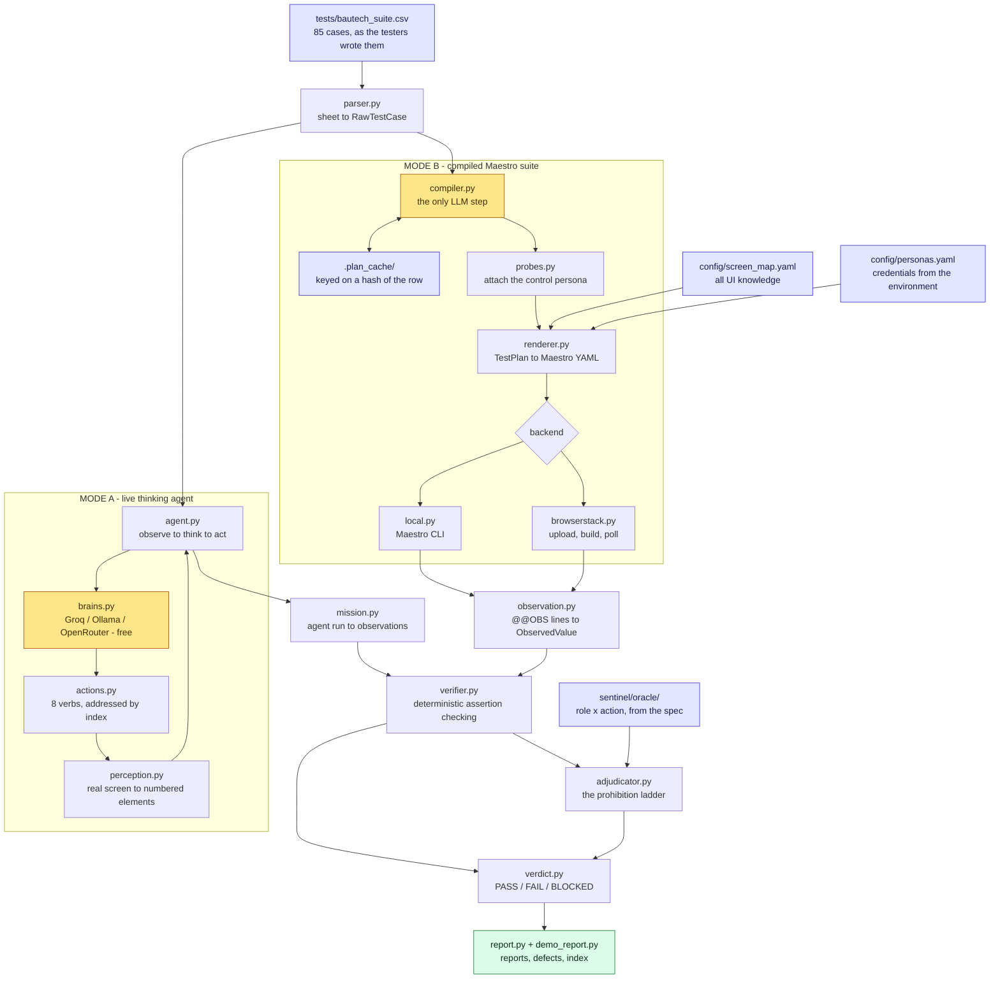

<div align="center">

# Bautech Sentinel

**An autonomous QA agent for the Bautech Android app.**

It reads a regression sheet the way a human tester would, drives the real app on a real device,
observes what actually happened, and returns a verdict — `PASS` / `FAIL` / `BLOCKED` — with the
evidence that earned it.


</div>

---

## Contents

| | |
|---|---|
| **[1. What This Is](#1-what-this-is)** | The problem, and why an agent rather than a script |
| **[2. Two Execution Modes](#2-two-execution-modes)** | The live agent and the compiled suite — when each applies |
| **[3. Quick Start](#3-quick-start)** | Clean machine to first result |
| **[4. Using the Agent](#4-using-the-agent)** | **Operator's guide — start here to run it** |
| **[5. Architecture](#5-architecture)** | The pipeline, and the trust boundary |
| **[6. Proving a Negative](#6-proving-a-negative)** | The hardest twenty points in the assessment |
| **[7. Results to Date](#7-results-to-date)** | Measured outcomes, not projections |
| **[8. Verifying the System Itself](#8-verifying-the-system-itself)** | 290 checks, no device required |
| **[9. Cost](#9-cost)** | Why a full run is free |
| **[10. Project Structure](#10-project-structure)** | Where everything lives |
| **[11. Status and Limitations](#11-status-and-limitations)** | Honest accounting |
| **[12. Defects Found](#12-defects-found)** | What Sentinel found in Bautech |

---

## 1. What This Is

Navicon's Bautech regression suite is 85 hand-written cases across three personas — Owner, Admin and
Site Engineer — in the operations team's own words:

> **TC-009** · *Site Engineer* · `Sites -> look for Add Site.` · **Expected:** *Blocked — no Add Site
> option for Site Engineer.*

Sentinel takes that sentence, unmodified, and produces a defensible verdict about the real app.

**This is not a test-automation framework.** A framework needs a human to translate that row into
selectors and assertions. Sentinel does the translation itself, and — in its live mode — decides
each tap while looking at the screen, the way a tester does. Three properties separate the two:

| | Automation script | Sentinel |
|---|---|---|
| **Input** | Code a developer wrote | The tester's sentence, verbatim |
| **Navigation** | A fixed, pre-recorded path | Decided live, from what is on screen now |
| **An unexpected screen** | Fails | Is read, reasoned about, and worked around |
| **Polarity** *(pass-case or block-case)* | Declared by the author | Inferred from the Expected column |
| **When lost** | Fails — or worse, silently passes | Says so, and says why |

That last row is the design's centre of gravity. A QA system that cannot distinguish *"the app
correctly blocked me"* from *"my automation broke"* will manufacture green results, and every other
feature it has is worthless. Sentinel refuses to guess — see [Proving a Negative](#6-proving-a-negative).

### What the agent is deliberately never told

- **Which cases are negative.** No flag, no marker, no hint from the permission matrix. The 13 rows
  whose titles carried a `[MUST BE BLOCKED]` editorial tag are stripped at parse time, because six
  of the nineteen prohibitions hide theirs in prose instead. Polarity is read from the *Expected*
  text alone, so the result is provably a reading of the requirement rather than an echo of a label.
- **How to do arithmetic.** The agent records `500` and `600`; a deterministic verifier computes the
  delta. No model anywhere in this system is permitted to decide whether a case passed.

---

## 2. Two Execution Modes

Sentinel ships two execution paths over one shared judgment core. This is not redundancy — each
exists because the other is structurally impossible in its counterpart's environment.

```
                    ┌──────────────────────────────────────┐
                    │  tests/bautech_suite.csv  (85 rows)  │
                    └──────────────────┬───────────────────┘
                                       │
              ┌────────────────────────┴────────────────────────┐
              ▼                                                 ▼
   ╔═══════════════════════╗                       ╔═══════════════════════╗
   ║   MODE A — LIVE       ║                       ║   MODE B — COMPILED   ║
   ║   thinking agent      ║                       ║   Maestro suite       ║
   ╠═══════════════════════╣                       ╠═══════════════════════╣
   ║ observe → think → act ║                       ║ plan once → render →  ║
   ║ every step, on-device ║                       ║ batch-execute         ║
   ║ driver: adb           ║                       ║ driver: Maestro       ║
   ║ target: local phone   ║                       ║ target: local + cloud ║
   ╚═══════════╤═══════════╝                       ╚═══════════╤═══════════╝
               │                                               │
               └──────────────────┬────────────────────────────┘
                                  ▼
                 ╔══════════════════════════════════════╗
                 ║   SHARED, DETERMINISTIC JUDGMENT     ║
                 ║   verifier · adjudicator · verdict   ║
                 ║   No model. Same code. Same rules.   ║
                 ╚══════════════════════════════════════╝
```

**Mode A — the live thinking agent.** Perceives the real screen over `adb`, chooses one action at a
time against a numbered element list, and re-observes after each. Adaptive, resilient to UI change,
and the only mode that can handle a screen nobody anticipated. Requires a device it can talk to
interactively.

**Mode B — the compiled Maestro suite.** Each row is planned once by an LLM into a structured
`TestPlan`, cached by content hash, then rendered to Maestro YAML and executed as a batch.
Deterministic, parallelisable, and — critically — **the only mode BrowserStack can run at all**,
because its Maestro integration is upload-and-poll: app, zipped flows, build request, result. Nothing
can make a live decision on a cloud device mid-run, so every decision must be made before upload.

| | **Mode A · Live Agent** | **Mode B · Compiled Suite** |
|---|---|---|
| Entry point | `tools/live_demo.py` | `run.py` |
| UI driver | `adb` + custom perception | Maestro CLI / BrowserStack |
| Decides taps | Live, per step | Ahead of time, once |
| Handles an unforeseen screen | **Yes** | No |
| Runs on BrowserStack | No *(impossible by design)* | **Yes** |
| Runs 85 cases in parallel | No | **Yes** |
| LLM calls per re-run | One per step | **Zero** (cache hit) |
| Best for | Exploration, adaptation, live walkthrough | Unattended regression, cloud, scale |

> **Recommended:** Mode B for the full unattended regression run; Mode A to demonstrate reasoning, to
> attack a case Mode B declined, or to explore an unmapped screen.

---

## 3. Quick Start

### Prerequisites

| Requirement | Needed for | Check |
|---|---|---|
| Python 3.10+ | Everything | `python --version` |
| [Maestro CLI](https://maestro.mobile.dev/) | Mode B | `maestro --version` |
| Android platform-tools (`adb`) | Mode A, local Mode B | `adb devices` |
| An Android device or emulator | Any live run | `adb devices` shows one |
| A free [Groq](https://console.groq.com) API key | The agent's brain | — |
| BrowserStack App Automate | Cloud runs only | — |

### Install

```bash
git clone https://github.com/naveen-astra/Bautech-TestA.git
cd Bautech-TestA
pip install requests pyyaml pydantic anthropic
cp .env.example .env          # then fill it in — see below
```

### Configure

Everything is environment variables, resolved at render time and never written into a flow file —
flows get zipped and uploaded to a third party, so nothing secret can travel in them.

```ini
# The agent's brain. Free by default.
SENTINEL_BRAIN=groq
SENTINEL_BRAIN_MODEL=openai/gpt-oss-120b
GROQ_API_KEY=gsk_...

# Persona credentials — Firebase test numbers with fixed OTP codes,
# so no SMS is sent and no reCAPTCHA appears.
BAUTECH_OWNER_PHONE=...        BAUTECH_OWNER_OTP=...
BAUTECH_ADMIN_PHONE=...        BAUTECH_ADMIN_OTP=...
BAUTECH_ENGINEER_PHONE=...     BAUTECH_ENGINEER_OTP=...

# Cloud execution only
BROWSERSTACK_USERNAME=...      BROWSERSTACK_ACCESS_KEY=...
```

`.env.example` documents every variable. `.env` is gitignored.

### Prove it works — no device needed, 30 seconds

```bash
python tools/selftest.py        # 31 checks — no broken evidence can produce a PASS
python tools/agent_tests.py     # 36 checks — the live agent's loop is sound
python tools/roundtrip.py       # the whole pipeline, three simulated app behaviours
```

### First real result

```bash
adb devices                     # confirm the phone is attached and authorised
python tools/live_demo.py       # the agent reads the current screen and reasons about it
```

A browser opens on a self-contained report. **You are running.**

---

## 4. Using the Agent

> *This section is the operator's guide. Everything above it is context; everything below it is what
> you actually type.*

### 4.1 Mode A — the live thinking agent

The agent is handed a case and a real screen, and works out the rest itself.

```bash
# Read whatever is on screen right now and identify it  (safest first run)
python tools/live_demo.py

# Run a specific case
python tools/live_demo.py --case TC-006     # Owner views the site list
python tools/live_demo.py --case TC-009     # negative: Engineer must not see "Add Site"
python tools/live_demo.py --case TC-072     # negative: Engineer sees Site A data only

# Log in first, as the case's persona, then run it
python tools/live_demo.py --case TC-009 --login

# Give a harder case more room to think  (default 12)
python tools/live_demo.py --case TC-072 --max-steps 25

# Attach to the session already open on the phone, don't relaunch
python tools/live_demo.py --no-launch
```

| Flag | Effect | Default |
|---|---|---|
| `--case` | `TC-006`, `TC-009`, `TC-072`, or `LOOK` | `LOOK` |
| `--login` | Run the deterministic login as the case's persona first | off |
| `--max-steps` | Step budget; the run stops honestly when exhausted | `12` |
| `--no-launch` | Don't relaunch the app — resume the current session | off |

**What you will see.** The terminal narrates every decision as it happens:

```
 1. confirm I am on 'Sites List' because: the list shows site entries
    such as 'Aqua Line Mumbai' and a 'New Site' control   -> confirmed
 2. scroll down                                            -> scrolled
 3. note site_count = "2"                                  -> recorded
 4. finish: both sites visible with correct names          -> done
```

Each line is a real decision made against a real screen. Nothing is replayed.

**Why the agent cannot mis-tap the status bar.** Perception filters every node to the app's own
package, then hands the model a numbered list. The model says *"tap 14"* — and element 14's exact
bounds are already held. No selector is ever constructed, so no selector can be ambiguous. The entire
class of fuzzy-matching bugs simply does not arise at this layer.

**The agent's eight verbs.** `tap` · `type_text` · `scroll` · `back` · `hide_keyboard` ·
`note` · `confirm_screen` · `report_attempt` — terminating in `finish` or `give_up`.

Two of those carry the assessment's hardest requirement:

- **`confirm_screen`** — before drawing any conclusion, the agent must name something only that screen
  shows. An absence noticed on the wrong screen proves nothing, and is never allowed to become a pass.
- **`report_attempt`** — when a case says to try something forbidden, the agent *actually tries it* and
  reports what the app really did: `refused`, `no_change`, `succeeded`, `error` or `stalled`. A
  prohibition that turns out **not** to be enforced is reported plainly, never buried.

### 4.2 Mode B — the compiled suite

```bash
# Plan and render everything against the screen map — executes nothing.
# The fastest way to see what the system intends to do.
python run.py --dry-run

# Full suite on a local device
python run.py

# A subset, while developing
python run.py --only TC-046,TC-009

# Cloud execution on BrowserStack
python run.py --backend browserstack --app app-release_3.apk

# Re-run a flow that CRASHES before reporting  (never a genuine FAIL)
python run.py --max-retries 2
```

| Flag | Purpose |
|---|---|
| `--dry-run` | Plan and render only — no device required |
| `--only` | Comma-separated case IDs |
| `--backend` | `local` (default) or `browserstack` |
| `--app` | Path to the APK — required for BrowserStack |
| `--device` | Device ID, or comma-separated cloud devices |
| `--timeout` | Whole-run budget in seconds (default `1800`) |
| `--max-retries` | Bounded retries for crashed flows (default `1`) |

**One-click demo:** `run_demo.bat` (Windows) runs the cases proven end-to-end on real hardware and
opens the report the moment it finishes.

### 4.3 Reading the results

Every live-agent run writes **one self-contained folder** — never scattered loose files:

```
results/demos/
  index.html                      ← every run ever, newest first.  START HERE.
  20260911-102921_TC-006/
    report.html                   ← verdict, reasoning trace, screenshots, cost — one page
    screen_start.png              ← what the agent saw first
    screen_final.png              ← where it ended up
    trace.txt                     ← the full step-by-step decision log, plain text
```

`index.html` is rebuilt from what is actually on disk on every write, so deleting a run's folder
removes it from the index. The index cannot drift from reality.

Mode B writes a fuller set per run:

```
results/<run-id>/
  report.md · report.html         every case, its verdict, and the evidence behind it
  defects.md                      failures only, written up ready to file
  results.json                    machine-readable, one object per case
  console.log                     the raw device log, kept for disputes
  TC-046-0-final.png              screenshots, cited by the verdicts that used them
```

### 4.4 Adding or rewording a case

Open `tests/bautech_suite.csv`, add a row, save. **No code changes.**

```csv
TC-086, Add cement stock, Site Engineer, Material -> Add purchase -> Cement 50 bags -> Save, Stock increases by 50
```

```bash
python run.py --only TC-086
```

The plan cache is keyed on a hash of the row's text, so **rewording an existing case is a cache miss
that replans automatically** — which is exactly what makes a live walkthrough with reworded cases
cost nothing. The live agent needs no cache at all: it reads whatever sentence you give it.

### 4.5 When something goes wrong

| Symptom | Cause | Fix |
|---|---|---|
| `no device found` | Phone not attached or not authorised | `adb devices` — accept the USB-debugging prompt |
| `could not read the screen` | App not in the foreground | Drop `--no-launch`, or open the app by hand |
| Agent gives up on the login screen | **Known Bautech defect** — OTP verification does not complete on a fresh session | Log in manually once, then run with `--no-launch` |
| `BrainError: ... rate limit` | Groq's per-minute token ceiling | It waits and retries automatically; nothing to do |
| `refuses to render: unverified target` | Screen-map target not yet confirmed against real hardware | Confirm it from a real hierarchy dump — or set `SENTINEL_ALLOW_UNVERIFIED=1`, exploration only |
| Screen locks mid-run | A real phone sleeps; an emulator never does | Keep the display awake for the run |

---

## 5. Architecture



| Stage | Module | Decided by | Output |
|---|---|---|---|
| Parse | `parser.py` | Code | `RawTestCase` per row, or a hard error |
| **Perceive** | `perception.py` | Code | One screen as numbered `Element`s, app-only |
| **Think** | `brains.py` + `agent.py` | **LLM** | The next single action |
| **Act** | `actions.py` | Code | A tap, by index, against known bounds |
| Compile | `compiler.py` | **LLM**, cached | `TestPlan` — segments, capabilities, assertions |
| Probe | `probes.py` | Oracle lookup | Control half of each differential probe |
| Render | `renderer.py` | Code | Maestro YAML; credentials passed as parameters |
| Execute | `backends/` | Maestro | `maestro.log`, screenshots, video |
| Observe | `observation.py` · `mission.py` | Code | `ObservedValue` per recorded fact |
| Verify | `verifier.py` | Code | One result per assertion |
| Adjudicate | `adjudicator.py` | Code + oracle | Prohibition upheld, or automation failure |
| Judge | `verdict.py` | Code | `CaseResult` with evidence and failure class |
| Report | `report.py` · `demo_report.py` | Code | Reports, defect list, run index |

### The trust boundary

> **The model is asked what a case *means*. It is never asked whether a case *passed*.**

That question is settled entirely by comparing recorded observations against declared assertions.
Three consequences follow, and all three are enforced by the code rather than by convention:

1. **A plan names intent, never mechanics.** A step says `stock_level`, never a selector — only the
   screen map knows what that resolves to, so the compiler cannot invent UI it has never seen.
2. **An assertion declares the observations it consumes.** A missing observation at verification time
   is an automation failure *by construction*, not because someone remembered to check.
3. **No verdict without evidence.** `CaseResult` refuses to construct without at least one piece of
   evidence, and refuses any non-`PASS` verdict without a failure class separating an app defect from
   the automation's own breakage.

An identical log always yields an identical verdict. A re-run of an unchanged suite makes zero LLM
calls in Mode B.

---

## 6. Proving a Negative

Nineteen of the 85 cases assert that something must **not** happen. They are worth twenty points, and
they are where the assessment is actually won or lost.

The trap: *"I could not open Site B"* is exactly as consistent with a broken selector as with correct
enforcement. A system that reads absence as success will cheerfully pass a suite pointed at the wrong
screen entirely.

**A prohibition never passes on absence alone.** It has to clear a ladder:

| Rung | What it establishes | If it fails |
|---|---|---|
| **a. Reachability** | We proved we were on the right screen | `AUTOMATION_FAILURE` — never `PASS` |
| **b. Affordance** | The control was genuinely not there | falls through to (c) |
| **c. Differential** | The identical probe **does** find it for a permitted persona | `AUTOMATION_FAILURE` — our selector is broken |
| **d. Enforcement** | If the control existed, attempting it was refused | — |
| **e. State** | Nothing actually changed | inconclusive → `BLOCKED` |

### The differential probe

To claim a Site Engineer cannot see *"Add Site"*, the same probe runs as an Admin in the same session:

- **Admin sees it, Engineer does not** → the selector works and the app is enforcing → `PASS` is defensible.
- **Neither sees it** → our selector is broken → `AUTOMATION_FAILURE`, reported as *our* defect, never
  as an app pass.

`config/screen_map.yaml` records which spec action each control implements, and `sentinel/oracle/`
knows who the specification permits — so the control persona is **looked up, never hardcoded**.

Where no persona is permitted the action at all (TC-080: *"no DMs in V1"*), the differential rung is
structurally unavailable, and the case reports `BLOCKED` with that reason rather than a pass the
evidence cannot support.

In the live agent the same discipline is carried by `confirm_screen` (rung a) and `report_attempt`
(rungs c–d): the agent must cite what it can actually see before concluding anything, and must really
attempt the forbidden action rather than infer its refusal.

---

## 7. Results to Date

Every figure below is measured, reproducible from this repository, and re-derivable with the command
shown.

### Reading polarity from prose — with no hints

```bash
python tools/final_tally.py
```

| Metric | Result |
|---|---|
| Cases in the sheet | **85** |
| Planned and cached | **85 / 85** |
| Official negatives correctly derived as a structural prohibition | **15 / 19** |
| Honestly missed | **1** — TC-068, planned as semantic rather than as a prohibition |
| Honestly declined as not-yet-automatable | **3** — TC-019, TC-044, TC-064, each naming its screen-map gap |
| **Bonus** prohibitions caught *outside* the official 19 | **7** — TC-003, 004, 007, 010, 015, 023, 024 |

Those seven are compound rows with a negative buried inside them. Nobody flagged them; the system
found them anyway. The agent was never told which rows were negative — polarity came purely from
sentences like *"Blocked — no Add Site option for Site Engineer."*

### On real hardware

| Proven | Evidence |
|---|---|
| Perception reads a real Bautech screen, app-only | 18 elements from 10,412 chars of raw XML → 909 chars rendered; **zero** system-UI leakage |
| The agent reasons about a real screen and cites evidence | *"confirm on 'Sites List' because: the list shows site entries such as 'Aqua Line Mumbai'…"* |
| The agent solves an unforeseen obstacle unprompted | Blocked by the OTP defect, it tried **"Sign in with Google"** on its own and authenticated |
| Deterministic login, repeatably | Verified against real Android state (`dumpsys input_method`), not fixed sleeps |
| Local Maestro backend | 3 consecutive runs, identical verdicts |
| **BrowserStack, live** | Real build on **Samsung Galaxy S22 · Android 12**; session JSON, device logs, Maestro logs and video all retrieved through the API |

> The BrowserStack run reported `failed` — **because the app failed to log in**, which is precisely
> the defect documented in [§12](#12-defects-found). The backend itself completed its full
> upload → build → poll → retrieve cycle correctly. Sentinel reported what actually happened rather
> than what would have looked better.

### Findings reproduced on real hardware

Each was found by reading an actual failure — a screenshot or a hierarchy dump off a physical device
— never guessed at, and each is now a standing rule rather than a one-off patch.

- **Flutter merges a whole widget's text into one accessibility node.** A tab's real label was
  `"Phone\nTab 1 of 2"`. Confirmed in three independent widgets → every emitted text selector is
  fuzzy-matched by default. *(Mode A sidesteps this entirely by addressing elements by index.)*
- **The on-screen keyboard covers controls at the bottom of the screen.** A tap resolves through the
  accessibility tree, not pixels, so it reports success while the physical touch lands on the
  keyboard. Fixed with a *verified* dismissal — `mInputShown` is read back, never assumed.
- **A reachability check immediately after resuming an app has no patience.** Every anchor check now
  waits before it judges.
- **A real phone locks its screen mid-run; an emulator never does.**

---

## 8. Verifying the System Itself

**290 checks across ten suites, plus a full pipeline round trip — none of which need a device.**

```bash
python tools/selftest.py            # 31 — no broken evidence can produce a PASS
python tools/component_tests.py     # 58 — malformed input is refused
python tools/browserstack_tests.py  # 47 — the cloud batch boundary
python tools/agent_tests.py         # 36 — the live agent's loop
python tools/brain_tests.py         # 29 — the brain is swappable and never silently paid
python tools/report_tests.py        # 26 — one folder, one report, one index
python tools/mission_tests.py       # 22 — the agent decides how, never whether
python tools/otp_relay_tests.py     # 19 — the email-OTP fallback
python tools/scheduler_tests.py     # 13 — persona-wave scheduling
python tools/retry_tests.py         #  9 — retries recover crashes, never mask a defect
python tools/roundtrip.py           # the whole pipeline, three app behaviours
```

Three of these carry more weight than the rest:

- **`selftest.py`** covers every way a verdict can go wrong — a broken selector, a screen never
  reached, evidence never captured. **None is allowed to produce a `PASS`.** If that guarantee ever
  breaks, this suite can manufacture green results and nothing else here is worth trusting.
- **`roundtrip.py`** drives real cases against three simulated app behaviours — healthy, a seeded
  regression, and broken automation — and checks each lands on the correct verdict *and* the correct
  failure class. Only the device is faked: the flow is really rendered, the log is really parsed by
  the same code that reads `maestro.log`, and the verdict is really decided by the adjudicator.
- **`mission_tests.py`** proves the boundary holds: numbers settled by subtraction rather than agent
  opinion; absence unproven without a confirmed screen; a forbidden action that *succeeded* reported
  rather than buried; a lost agent producing `BLOCKED` rather than a verdict.

---

## 9. Cost

**A full run costs nothing.** This is a design property, not a coincidence.

| Component | Cost |
|---|---|
| The agent's brain | **$0.00** — Groq free tier, or Ollama locally with no limits at all |
| Plan compilation (85 cases) | **$0.00** — same free provider, then cached, so re-runs are free by construction |
| Maestro | $0.00 — open source |
| BrowserStack | $0.00 — free tier |
| The device | One you already own |

One adapter speaks the OpenAI chat-completions protocol, which is also spoken by Groq, Ollama,
OpenRouter, LM Studio, llama.cpp and vLLM — so a free hosted tier and a local model on your own GPU
are the same code path with a different base URL. Anthropic's API is supported as an explicit,
opt-in fallback that **fails loudly, naming the free alternatives**, rather than silently spending
money.

**Why a small free model suffices here** — not because small models are secretly as good, but because
this agent's job was deliberately made narrow. On each step the model sees roughly 900 characters (a
numbered list of one screen) and picks one of eight verbs against an element index. It never parses
XML, never composes a selector, never chooses from an open-ended action space. Where a weaker model
does show through is judgment under ambiguity — and that surfaces as `give_up`, which is honest and
cheap, because no model here is ever allowed to decide a verdict.

Measured: compiling all 85 cases cost **33 calls, 89,588 in / 28,739 out, 95 s of thinking — $0.00.**

---

## 10. Project Structure

```
run.py                      Mode B entry point — the single command
run_demo.bat                one-click demo (Windows)

config/
  screen_map.yaml           ALL UI knowledge — selectors, screens, forms
  personas.yaml             who signs in, and how the OTP is obtained
tests/
  bautech_suite.csv         the 85 cases, as the testers wrote them
  fixtures/                 real captured hierarchies, for device-free tests

sentinel/
  ── the live thinking agent (Mode A) ──────────────────────────────
  perception.py             real screen  ->  numbered elements, app-only
  actions.py                the 8 verbs, addressed by index
  agent.py                  observe -> think -> act, with a step budget
  brains.py                 Groq / Ollama / OpenRouter / LM Studio / Claude
  login.py                  deterministic login — no LLM, verified state
  mission.py                agent run  ->  observations  ->  formal verdict
  demo_report.py            one folder, one report, one index

  ── the compiled suite (Mode B) ───────────────────────────────────
  parser.py                 sheet  ->  RawTestCase
  compiler.py               LLM: RawTestCase  ->  TestPlan, cached
  probes.py                 attaches the control half of each differential probe
  screen_map.py             logical target  ->  Maestro selector
  renderer.py               TestPlan  ->  Maestro YAML, and the @@OBS protocol
  scheduler.py              persona-wave DAG
  backends/                 local (Maestro CLI) · browserstack (batch API)
  junit.py                  reads a JUnit report back for testCaseId -> failed
  otp_relay.py              email-OTP fallback

  ── shared judgment (both modes) ──────────────────────────────────
  schema.py                 the TestPlan contract and its invariants
  observation.py            logs  ->  ObservedValue
  verifier.py               deterministic assertion checking
  adjudicator.py            the prohibition ladder
  verdict.py                assertion results  ->  PASS / FAIL / BLOCKED
  report.py                 report.md, report.html, defects.md, results.json
  oracle/                   role x action permission matrix, from the spec

tools/
  live_demo.py              ** Mode A on a real phone **
  run_demo.py               ** Mode B, demo-configured, opens the report **
  think_offline.py          real model reasoning against a captured screen
  brain_check.py            one live call — is the brain reachable?
  final_tally.py            negative-case scorecard across all 85 plans
  compile_remaining.py      compile whatever is not yet cached
  extract_suite.py          rebuild the CSV from the source document
  inspect_apk.py            package info + UI vocabulary from a build
  *_tests.py                290 checks, no device required

docs/
  phase1_discovery.md            real-device environment findings
  navicon_email_login_reset.md   the login defect, as reported to Navicon
```

### How observations get home (Mode B)

A flow prints each observation as one JSON line behind a marker:

```
@@OBS {"key":"stock_before","raw":"500 bags","anchor":true}
```

`observation.py` reads these back out of `maestro.log` locally, or out of BrowserStack device logs in
the cloud — stdout is the one channel both environments preserve, so no separate transport is needed.

Flows are written defensively for a specific reason: **a bare assertion that fails aborts the flow,
and an aborted flow reports nothing.** A test proving a *negative* has to observe the absence, not die
of it — so every check is a conditional that records what it saw and continues, and judgment happens
afterward in Python where it can be reasoned about explicitly.

---

## 11. Status and Limitations

### Component status

| Component | Status |
|---|---|
| Test-sheet extraction · parser · plan schema | **Complete** |
| Permission oracle (role × action) | **Complete** |
| Plan compiler — all 85 cases compiled and cached | **Complete** |
| Perception · actions · agent loop · brains | **Complete** — proven on real hardware |
| Deterministic login | **Complete** — mechanically reliable every run |
| Differential probe generation | **Complete** |
| Maestro renderer & observation protocol | **Complete** — hardened by real-device findings |
| Verifier · adjudicator · verdict engine · reporting | **Complete** |
| Bounded retries | **Complete** — re-runs a crash, never a real `FAIL` |
| Local backend | **Proven** — 3 consecutive identical real-device runs |
| BrowserStack backend | **Proven live** — build executed, artifacts retrieved |
| Demo reporting & index | **Complete** |
| Screen map — loader, lint, verification gate | **Partial — 4 / 41 targets verified** |

### Known limitations — stated plainly

- **Most of the screen map is unverified.** `4 / 41` targets are confirmed against real hierarchy
  dumps (`site_home`, `material`, `tasks`, `emb`); the rest carry an unconfirmed selector. **The
  renderer refuses to emit a flow for an unverified target** unless `SENTINEL_ALLOW_UNVERIFIED=1` is
  explicitly set. This is the direct cause of the cases the compiler declines — the honest answer is
  *"I have not seen that screen"*, not a weaker check substituted silently. Mode A has no such
  dependency, which is the clearest path to closing the gap.
- **The live agent has not yet performed a write action** — create, submit, approve — end to end on a
  real device. Every live run so far has been read-only or exploratory.
- **No live run has yet gone through the full formal verdict bridge.** `mission.py` is complete and
  tested, but live demos to date show the reasoning trace rather than a formal `CaseResult`.
- **Persona switching is blocked by the app's own login defect** ([§12](#12-defects-found)). Only the
  currently authenticated persona can be exercised live until that is resolved.
- **The screen-map lint reports 2 unusable anchors**, down from 11. `reports` and `issues` are still
  anchored on the same text as the control that navigates to them, so the check would pass whether or
  not the screen actually opened. `run.py` surfaces these as warnings on every run.
- **A handful of cases are genuinely untestable** through the interfaces available today — billing
  changes that only take effect next cycle (TC-027), pause/unpause billing (TC-028, TC-029), an hours
  threshold that must be crossed (TC-055), quiet hours that must elapse (TC-084). The compiler marks
  these `needs_unavailable_interface` and **names the missing capability** rather than substituting a
  weaker check.
- **No full-suite wall-clock measurement exists yet.** The two-hour budget remains a projection until
  a complete run is timed on real hardware.

---

## 12. Defects Found

### Bautech defects

**BAU-001 · OTP verification does not complete on a fresh session** · *Severity: blocker*

On a session for an account with existing company data, OTP verification does not complete and the
app returns to onboarding. Reproduced across **Owner and Admin**, on **both BrowserStack and physical
hardware**, through **three completely independent automation paths** — Maestro flows, the
BrowserStack batch backend, and the live agent's raw `adb` driver. Three independent code paths
reaching the same wall is strong evidence of a genuine app defect rather than a tooling artifact.

The Site Engineer test account — which has no company yet — does *not* hit this reset and logs in
cleanly every time, landing on "Create Company / Join Company" instead. That asymmetry is itself
informative: see `docs/navicon_email_login_reset.md` for why it points at post-login data hydration
rather than the login mechanics themselves. (The Site Engineer account has a separate, seemingly
unrelated issue: its own "Create Company" button does not respond to taps at all.)

*Impact:* blocks unattended multi-persona execution. Reported to Navicon — see
`docs/navicon_email_login_reset.md`. **Awaiting response.**

### Automation failures

None outstanding. Every automation defect found during development is listed in
[§7](#7-results-to-date) alongside the standing rule that now prevents it.

> Sentinel keeps these two lists **structurally separate** in `defects.md`. Conflating *"the app is
> broken"* with *"our automation is broken"* is the single failure mode this entire system exists to
> avoid.

---

<div align="center">

**Bautech Sentinel** · Built for Navicon InfraProjects

*The agent decides **how**. It never decides **whether**.*

</div>
